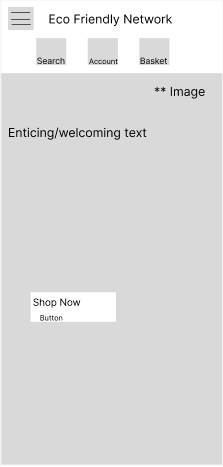
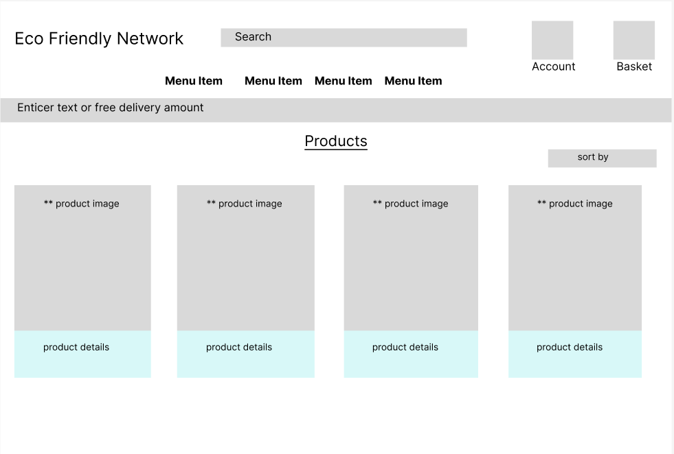
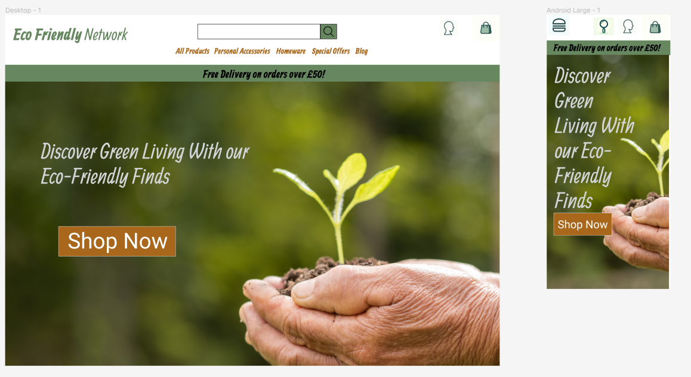
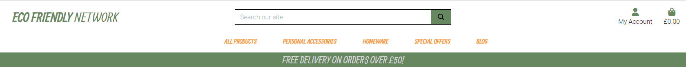
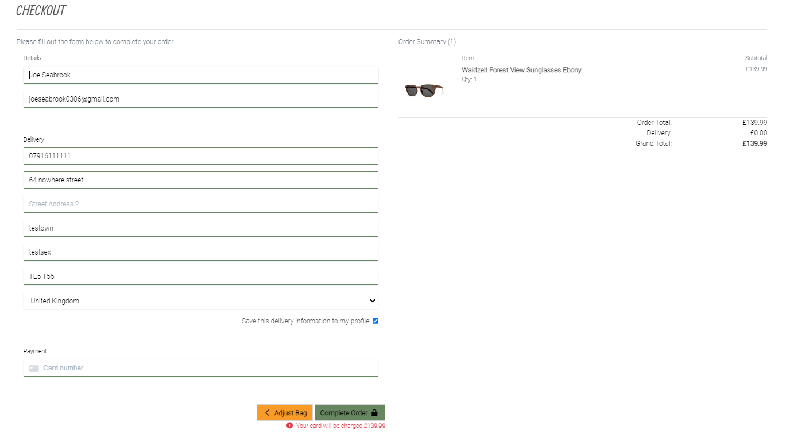
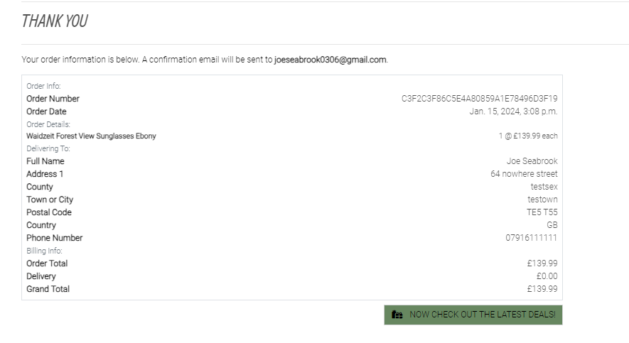
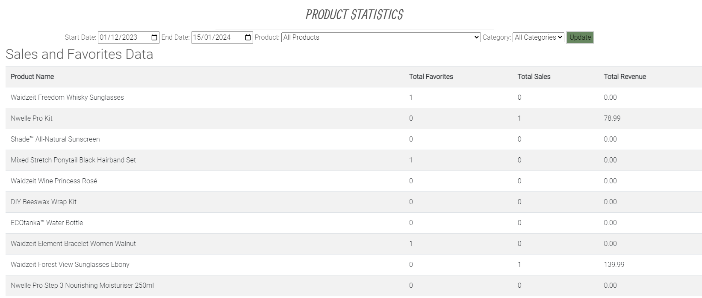

# [Eco Friendly network](https://ecofriendlynetwork-82b71b042579.herokuapp.com/)
An Eco friendly eccomerce store selling many diffent items. The website was created for people passionate about eco friendly living. The online shop offers products from different brands and it's aim is to encourage people to easy and friendly e-shopping.

**Code Institute - Milestone Project 4**

HTML / CSS / Python / Django / Jquery

By Joe Seabrook


## Strategy

### The 5 Planes

- **Purpose of the website?**
    
    Eco Friendly Network is an innovative e-commerce store dedicated to revolutionizing the way we approach consumerism, with a staunch commitment to environmental sustainability. Our platform's primary purpose is to bridge the gap between the growing demand for eco-friendly products and the global need for sustainable living practices. By meticulously curating a diverse range of environmentally responsible products, we aim to make sustainable choices readily accessible and convenient for everyone. Eco Friendly Network isn’t just about buying and selling; it's a catalyst for change, fostering a digital space where conscious consumerism thrives and where every transaction contributes positively to the wellbeing of our planet. Our focus lies in creating a seamless, informative, and empowering online shopping experience that aligns with the values of those who care deeply about their environmental footprint, thereby setting a new standard in the realm of eco-conscious e-commerce.

- **Target audience?**

    The Eco Friendly Network is specifically designed to cater to a diverse yet focused group of consumers who are united by their commitment to environmental sustainability. Our target audience encompasses:

    - **Environmentally Conscious Consumers:**
    
        Individuals who are actively seeking to reduce their ecological footprint through sustainable living choices. They prioritize products that are eco-friendly, ethically sourced, and have a minimal environmental impact.

    - **Eco-Friendly Lifestyle Adopters:**
    
        People who are in the process of transitioning to a more sustainable lifestyle. They are looking for accessible, affordable, and practical eco-friendly alternatives to everyday products.

    - **Ethical Shoppers:**
    
        Customers who make purchasing decisions based on the social and environmental impact of products. They support brands and platforms that align with their values of ethical production, fair trade, and responsible business practices.

    - **Tech-Savvy Shoppers:**
    
        A demographic that prefers the convenience of online shopping and is inclined towards platforms that offer a seamless, user-friendly digital experience.

    By understanding and catering to these key segments, Eco Friendly Network aims to create a meaningful impact in the sphere of sustainable consumerism, making it easy and appealing for individuals to make choices that are good for them and the planet.

- **Value to the user?**

    Eco Friendly Network provides distinct value to users through a focused selection of eco-friendly personal accessories and home essentials. Here's how this value is delivered:

    - **Curated Eco-Friendly Selection:**

        The platform specializes in a carefully chosen range of sustainable products, specifically in personal accessories like watches, bracelets, sunglasses, and home essentials in kitchenware, and bath & beauty products. This focus ensures that every item offered aligns with eco-conscious values and practices.

    - **Quality and Sustainability:**
    
        Each product in the collection is selected for its quality and sustainable attributes. Whether it's a bamboo watch or a biodegradable beauty product, It is ensured that the products meet high standards of both functionality and eco-friendliness.

    - **Personal Accessory and Home Essential Focus:**
    
        By specializing in specific categories, The store provides users with a targeted shopping experience. The range of personal accessories and home essentials caters to everyday needs, ensuring that users can easily incorporate sustainability into their daily lives.

    - **Contribution to a Greener Future:**
    
        Every purchase made on the platform is a step towards a more sustainable future. Users are not just buying a product; they are making a conscious choice to support environmentally friendly practices and reduce their ecological footprint.

    - **What makes a good experience ?**
    
        At Eco Friendly Network, we believe that a good user experience is fundamental to our mission and success. Here are the key elements that we focus on to ensure a positive and memorable experience for our users:

    - **Intuitive Navigation and Design:**
    
        A clean, user-friendly website design is crucial. The platform is structured for ease of navigation, allowing users to effortlessly browse through categories of personal accessories, kitchen items, and bath & beauty products. This straightforward approach helps users find what they're looking for without hassle.

    - **High-Quality Product Imagery and Descriptions:**
    
        We understand the importance of accurately representing our products. High-resolution images and detailed descriptions give users a clear understanding of what they are purchasing, aiding in making informed decisions.

    - **Secure and Efficient Checkout Process:**
    
        A smooth and secure checkout process is vital. The platform employs robust security measures to protect user data, coupled with an efficient checkout process to make transactions quick and hassle-free.

- **What we shouldn't do?**

    In the pursuit to offer an exceptional and sustainable shopping experience at Eco Friendly Network, there are certain practices that should be avoided:

    - **Overwhelming Our Users:**
    
        We steer clear of cluttering the platform with excessive product options or information. Keeping our range focused and our presentation clean ensures users can find what they need without feeling overwhelmed.

    - **Undermining Privacy and Security:**
    
        We do not compromise on the privacy and security of user data. Avoiding practices that could put user information at risk is a top priority.

    - **Inconsistency in Values:**
    
        We avoid stocking products that don't align with the core values of sustainability and ethical responsibility. Every product sold must contribute positively to our mission.

    - **Inadequate Product Descriptions and Imagery:**
    
        We avoid vague descriptions and low-quality images. Clear, accurate, and detailed product presentations are crucial for informed purchasing decisions.

    - **Making False Claims:**
    
        We strictly avoid exaggerating or misrepresenting the sustainability of our products. Honesty and transparency in how products are sourced and their impact are paramount.

    By consciously steering clear of these practices, Eco Friendly Network aims to build trust, ensure user satisfaction, and uphold commitment to promoting sustainable consumer choices.

### The Why

Eco Friendly Network was born out of a recognition of the urgent need for sustainable consumer habits in our daily lives. In a world increasingly burdened by environmental challenges, we understand the powerful role that individual choices can play. The platform bridges the gap between eco-conscious consumers and high-quality, sustainable products. We believe that making environmentally responsible choices should be straightforward and rewarding. By offering a curated selection of personal accessories and home essentials, we demonstrate that living sustainably does not mean compromising on style or quality. Eco Friendly Network is committed to showing that a sustainable lifestyle can be accessible, desirable, and a positive force for change in the world.

### The Business Goal

The primary business goal at Eco Friendly Network is to establish and grow as a leading online destination for sustainable personal accessories and home essentials. I aim to achieve this by:

- **Expanding Our Product Range:**

    Continuously broadening the selection of high-quality, eco-friendly products to meet the evolving needs and preferences of our customers.

- **Building Customer Loyalty:**

    Fostering strong relationships with our customers through exceptional service, reliability, and a deep understanding of their sustainable living goals.

- **Promoting Sustainability:**

    Actively contributing to the global movement towards environmental sustainability through our business practices and product offerings.

- **Achieving Financial Sustainability:**

    Ensuring the business is financially robust and growing, allowing us to invest further in our mission and expand our impact.

In essence, The goal is to seamlessly blend commercial success with commitment to sustainability, creating a platform where conscious consumerism is not just encouraged, but celebrated.

## UX
### Color Scheme

I researched colour schemes on [ShutterStock](https://www.shutterstock.com/blog/sustainable-design-color-palettes). I decided to choose their pre-made "Clean Living theme" . I did decide to replace their selection of #FB9B27(Tangerine) with #A8671A(Burnt Sienna) for contrast reasons.


### Color by color:

 - **Sage Green**


     - Connection with Nature: Green hues are typically linked with nature, suggesting a sense of growth, renewal, and life. This particular shade of green, reminiscent of natural foliage, can evoke feelings of being grounded and connected to the natural world.

     - Balance and Harmony: Green is considered a color of balance and harmony, derived from its position in the color spectrum being in the middle of warm and cool tones. This shade of sage green, with its balanced mix of green and gray, can reinforce these qualities.

     - Health and Wellness: Often, green is associated with health and wellness. This might be due to its prevalent presence in healthy natural foods and its representation of vitality and freshness.

     - Sophistication and Elegance: The muted quality of this sage green can impart a sense of sophistication and understated elegance. It's often used in interior design to create a chic, yet calming atmosphere.

     - Subtlety and Softness: Unlike brighter or darker greens, this shade is more subtle and soft, which can create a more welcoming and less overwhelming space. It's often favored in design for its versatility and gentle appearance.

- **Burnt Sienna**


    - Earthiness and Warmth: The color Burnt Sienna, with its deep, rich earth tone, embodies warmth and a grounded feeling. It is reminiscent of natural elements like soil and autumn leaves, bringing a sense of warmth and comfort to designs.

    - Stability and Strength: This shade of brown is often associated with stability and reliability. It can convey a sense of strength and resilience, making it a good choice for designs that aim to evoke feelings of security and dependability.

    - Rustic Charm: Burnt Sienna has a rustic quality that can add a charming, old-world feel to a design. It's ideal for themes that aim to reflect tradition, heritage, or a connection with the past.

    - Sophistication and Depth: As a deeper and more complex color than brighter oranges or yellows, Burnt Sienna provides a sophisticated palette. It can lend depth and richness to a design, making it suitable for elegant and refined themes.

	- Nostalgia and Comfort: This color can evoke feelings of nostalgia and comfort, reminiscent of cozy, autumnal settings. It's a color that can make a space or design feel more inviting and homely.

- **Peach**


    - Youthfulness: Peach, with its soft and gentle tone, can convey a sense of playfulness and youthfulness. It's often associated with the play and innocence of childhood.

    - Gentleness and Soothing Quality: Unlike more saturated oranges, peach's muted quality gives it a more soothing presence. It's less stimulating and more calming, making it suitable for places where relaxation is key.

    - Nourishment and Comfort: Similar to other warm tones, peach can evoke a sense of nourishment and care, partly because of its resemblance to natural, healthy foods.

- **Silver Grey**


    - Neutrality and Balance: Gray is often considered a neutral and balanced color. It doesn't evoke strong emotions, making it a stable and calming presence in design and environment.

    - Modern and Sophisticated: Light gray is frequently associated with modernity and sophistication. It's commonly used in minimalist and contemporary designs, reflecting a sense of sleekness and refined taste.

    - Practicality and Timelessness: Being a classic and practical color, light gray is seen as timeless. It doesn’t go out of style and can be easily integrated into various contexts and design themes.

It's important to note that the psychological impact of color is highly subjective and can vary based on cultural, personal, and situational factors. The interpretation of colors can differ greatly from person to person.

### Typography
I researched sustainable fonts on [Coconut Design](https://coconutdesign.eu/sustainable-website-fonts-and-the-proper-use-of-them/).

#### Headings & Logo Font


I chose Allan as my Headings font. This font appealed to me due to its many characteristics and psychological impacts, Including:

- **Bold and Assertive:** Allan is known for its bold strokes, making it assertive and attention-grabbing. This feature is excellent for headings as it draws the reader's eye and establishes a hierarchy in the text.

- **Friendly and Approachable:** Despite its boldness, Allan has a certain roundness and softness to its characters, which can convey a sense of friendliness and approachability. This can make your content feel more inviting to readers.

- **Modern with a Touch of Playfulness:** The font has a modern look with a slight touch of playfulness. This can be great for engaging a wide range of audiences without being too formal or too casual.

- **Excellent Readability:** Allan maintains high readability even in larger sizes, which is crucial for headings. This ensures that titles are easily legible, enhancing the overall user experience and facilitating better content navigation.

- **Aesthetic Appeal:** The stylistic flair of Allan adds a visual interest to the headings, contributing to the overall aesthetic appeal of the web Application.

#### Body Text


I chose Roboto for body text due suitable contrast to the Allan Headings, As well as its versatile characteristics and psychological impacts, including:

- **Clarity and Readability:** Roboto is renowned for its high legibility, which is essential for body text. Its clean and unambiguous letterforms ensure that content is easily readable, even in smaller sizes or dense paragraphs.

- **Modern and Minimalist Design:** With its geometric forms and open curves, Roboto has a modern and minimalist aesthetic. This design complements contemporary layouts and interfaces, providing a sleek and up-to-date look.

- **Subtle Personality:** Unlike more decorative fonts, Roboto offers a subtle personality that doesn't overpower the content. Its character lies in its functionality, supporting the text rather than taking center stage.

- **Enhancing User Experience:** Given its legibility and aesthetic neutrality, Roboto enhances the user experience by making the reading process effortless and pleasant, which is crucial for engaging and retaining the audience.

#### Fallback Font


As a best practice, I have also included Sans Serif as a fallback font in The design. In cases where browsers or devices may not support the specific fonts mentioned above, we use a generic sans-serif font. This ensures that the text remains legible and maintains a consistent appearance across various platforms.

All of my fonts were provided by [Google Fonts](https://fonts.google.com/)

## User Stories
### As a new user....

- I want to intuitively navigate the website and easily find eco-friendly products, so that I can shop without confusion.

- I want to see clear product descriptions and images, so that I know exactly what I'm buying.

-  I want to easily create an account, so I can track my orders, save my preferences, and have a personalized shopping experience.

- I want to access information about sustainability practices and product sourcing, so that I can make informed and environmentally-conscious purchasing decisions.

- I want a straightforward and secure checkout process, so I can complete my purchase quickly and with confidence in the security of my personal information.

- I may want to purchase without creating an account.

### As a returning user....

-  I want to be able to manage a user account and track my orders.

- I want the website to be responsive and user-friendly on my smartphone or tablet, so I can shop conveniently on the go.

-  I want to receive updates on promotions, new eco-friendly products, and sustainability initiatives, so I can stay engaged with the brand.

### As a site Admin.....

- I want to easily add, update, and remove product listings, ensuring all information is current and accurate, to maintain a reliable and up-to-date product catalogue.

- I want the ability to easily label products as 'Clearance', 'New Arrival', or 'Special Deals', so I can effectively promote specific items and attract customer interest, leveraging these categories as key marketing strategies alongside the blog.

- I want to access analytics and insights about user behavior and sales trends, so I can make data-driven decisions to improve the website and product offerings

## Wireframes

- **Home page**

    - Mobile

    

    - Tablet

    

    - Desktop

    

- **Product page**

    - Mobile

    

    - Tablet

    

    - Desktop 

    

- **Sign up page**

    - Mobile

    

    - Tablet

    

    - Desktop

    

## High Fidelity Prototypes

- **Home Page**



- **Products Page**


- **Product Details Page**


## Features
### Existing Features
- **Navigation Bar**	
	- The navigation bar is a central feature that enhances the user experience by providing easy access to key functionalities and content within Eco Friendly Network. Whether on a desktop or a mobile device, users can seamlessly navigate through the application with the help of this feature.
	- The Nav Bar consist of:
	- The Brand Logo text: which when clicked directs the user to the homepage 
	- A product search form along with product category and blog viewing options
	-  A shopping bag subtotal and link
	-  A My acccount drop down menu (containing links to profile and other options)
	- A Text banner Advertising the free delivery amount.
	- A Mobile nav view for smaller screens containing all above options in a more condensed form




- **Sign Up/Sign In**
	- Enhance your Eco Friendly Network experience by registering. Once signed up, you can save your favorite products and blog posts for quick access later. This personalized feature streamlines your shopping and reading experience, making it easier to return to the items and content you love most.
	- contains links for sign in

	

	- The sign in page enables users to access their accounts
	- Contains links for forgotten password and sign up

	

- **My Profile**
	- Allows users to view & update default delivery information
	- Displays user's list of placed orders
	- Gives users the option to delete their profile.

	

- **Products View**
	- This page displays products in a grid layout suitable for the viewing device.
	- This page is used to display All products aswell as category and search selections
	- This view is also used to display a list of the users favorite products accessible via the "My Account" menu.
	- All results in this view can be sorted via many factors contained in the "sort by" menu
	- Each product contains tags providing rating, category and wether the product is in their favorites
	- For superusers only, It also displays the total amount of favorites a product has by users as well as links to edit and delete a product
	- Includes "back to top button" featured below.

	

- **Back to top button**
	- This is included on products page to assist users with scrolling
	- The button only appears when the user starts to scroll
	- This function is in an includes file so it can be used on other pages/features as they are added.

	

- **Product Detail Page**
	- This page provides the user with a description of a product aswell as the information tags that were included on the products page
	- Here user's can find the link to add and remove the product from their favorites
	- Includes a quantiy selector input with the option to add the item to the bag or return to the products view
	- For superusers only, It also displays the total amount of favorites a product has by users as well as links to edit and delete a product
	
	

- **Shopping Bag**
	- This provides a place for customers to review their purchases before commiting to checkout
	- This page displays a list of products the User has added to their bag
	- Each product line item consists of the product thumbnail image, Title Price, Quantity with selection/Remove and line total/sub total
	- The Quantity selector automatically updates totals without the need for the use to click an update button, This was implemented for ease of use
	- After the list of items the bag total, delivery cost and grand total is displayed followed by the procced to checkout and back to shopping buttons
	- If the Free delivery amaount is not reached a note is displayed to advise the customer of what they need to spend to get free delivery.

	

- **CheckOut**
	- Offers an order summary and form for completing payment, with address information pre-filled for registered users.
	- Supports guest checkout, allowing non-registered users to complete purchases without creating an account, simplifying the process for first-time shoppers.	- Has buttons to return to bag and complete order, with a warning that the card will be charged.
	- Features return to bag and order completion buttons, with a card charge warning.
	-Includes a loading overlay to prevent interruptions during payment.
	- Utilizes Stripe for secure payment processing; see the "Stripe Payment and Webhooks" section(Below) for details.

	

- **Stripe Payment and webhooks**

	This feature ensures secure and efficient payment processing through Stripe. It integrates Stripe's comprehensive API to handle transactions, providing users with a seamless checkout experience. Webhooks are employed to maintain order integrity, capturing events such as successful payments and failures. This system guarantees that orders are only finalized when payment is confirmed, enhancing reliability and user trust.

- **Order Confirmation**
	- This page displays an ordery complete summary after a succesful checkout
	- Button to return to shop to see latest deals.

	

- **Order Confirmation email**
	- Upon completion of the order process the customer recieve a personalised confirmation email, To the email address supplied on the order.

	

- **Blog List**
	- This page provides a list of all blog posts in a grid layout suitable for the viewong device
	- This page is also used to display the user's favorite blogs which is accesible via the blog dropdown menu.
	- Each blog tile contains an Image, The blog title and excepert as well as the date posted and the author.
	- Link and icon displayed for users to add blog to favorites.
	- Links for superuser's only to edit and delete posts

	

- **Blog Detail**
	- This page shows the blog in a larger view, It provides the full blog article rather than just the excerpt.
	- Has the same links and information tags as on the blog list page

	

- **Toast Meassages**
	- Toast messages are displayed for many different event types including Success, Error , Info and Warning
	- Toast messages provide great functionality in informing the user of errors or succesful tasks.

	

- **Error Pages**
	The website is designed to be as resilient and user-friendly as the environment we strive to protect. However, on the rare occasion that something does go awry, our custom error pages are there to ensure a smooth user experience, even when navigating through digital hiccups.

	- **404 Not Found**
	This page appears when a user tries to access a page that doesn’t exist or has been moved.

	

	- **500 Internal Server Error**
	Encountering this page means the site is experiencing temporary technical difficulties. Our message reassures users that our team is already working on a solution, staying true to our commitment to sustainability by 'recycling' the error into a fix.

	

#### Super User Only Features
- **Add & Edit Products**
	- This form allows super users to add and edit products.
	- The Edit Product form is the same as the Add Product form except it is prefilled with the selected products information.
	- The Add product form can be accessed via the "My Account" dropdown nav menu
	- The Edit Product form can be accessed via clicking on the links on the product list and detail pages

	

- **Add & Edit Blog Posts**
	- This form allows super users to add and edit blog posts.
	- The content section for the blog post enables blogs to be written in HTML format To aquire the correct spacing/paragraphing required. Any content not written with HTML structuring will be displayed as on continuous piece with no paragraph seperation or sub headings etc.
	- The Edit Blog form is the same as Add Blog except it is prefilled with the selected blogs content.
	- The Add Blog page can be accessed via the "Blog" dropdown nav menu
	- The Edit Blog page can be accessed via the links on the blog list & detail pages

	

- **View Orders**
	- This page is accessible via the "My Account" dropdown nav menu
	- This page allows superusers to search and filter all customer orders
	- If a Order in the list is selected the super user is taken to the order reciept page with a button to return to the orders view.
	- This page was implemented so super users had a user friendly place to view and search orders.

	

- **Products Statistics page**
	- This page is accessible via the "My Account" dropdown nav menu
	- This page allows superusers to search and filter all products via category, product and dates, Returning the Statistics for the options selected.
	- The Favorites column Is not affected via date selection It simply shows how many users have the product saved as favorite at the time of viewing the page
	- This page was implemented to give Admin an accessible area where they can get required statistics helping them make stock decisions such as wether to discontinue a product or discount etc.

	

### Future Features

- **Pagination**
	The Store only currently has A few starter products, As the range of products increases there will be a lot displayed on the products page. I believe it will be nessacerry to add Pagination to enhace the user experience. This also applys to the Blog page as the amount of Blog posts increase.

- **Blog Search and Filter Functionality**
	As the number of blog posts on Eco Friendly Network increases, introducing a search feature will greatly enhance user experience. This functionality will allow users to quickly find blogs by keywords, authors, or topics, making the content more accessible and navigable.

- **User Statistics(For Admin)**
	A dedicated section for superusers to view comprehensive statistics about user activities. This dashboard could include metrics such as most ordered products, user order histories, frequency of purchases, and other relevant data. This feature would aid in making informed business and stock decisions. This feature would sit nicely along with the other Statistics features already included in the Site.

- **User Reviews and Ratings**
	Implementing a system where users can rate and review products and blog posts. This feature not only fosters a sense of community but also provides valuable feedback for continuous improvement. Currently ratings are displayed for products but these are taken from the supplier of the products rather than made by Eco Friendly Network's Users. I believe it would be better for both users and Admin that the ratings figure were coming directly from the store rather than the product source.

- **Share to Social Media**
	Enabling users to share their favorite products, blogs, or their own shopping experiences directly to social media platforms. This feature could increase the visibility of Eco Friendly Network and drive more traffic to the site.

## Database Design
During the development phase, I utilized SQLite for its simplicity and ease of configuration, which facilitated rapid prototyping and streamlined testing processes. This project employs Django's ORM capabilities within a relational database architecture to efficiently manage data interactions. While the initial stages relied on SQLite due to its straightforward setup and integration with Django, the transition towards deployment necessitated a more scalable and robust database solution.

For the deployed version of the application, I chose ElephantSQL and Amazon Web Services (AWS) to ensure enhanced performance, reliability, and scalability. ElephantSQL offers a managed PostgreSQL service that seamlessly integrates with our Django application, providing the robustness required for production without the overhead of database administration. Additionally, leveraging AWS for hosting and related services further solidifies the application's infrastructure, offering high availability, security, and the flexibility to scale resources according to demand.

### Model Flow Charts
- **Products**

	

- **Profiles**

	

- **Checkout**

	

- **Blog**

	

- **Sales Stats**

	

The Following graphs show connections between the different models.

- **Products, Sales Stats & Checkout**

	

- **Products, Profiles & Blog Posts**

	

- **Checkout and Profile**

	

The Models flow charts were created with [Diagrams.net](https://app.diagrams.net/)

## Marketing & Branding
I have Created a Facebook Page for Eco Friendly Network [View Here](https://www.facebook.com/Ecofriendlynetwork/), The page is created to be used as a crucial marketing channel with a singular focus: to direct people to The Eco Friendly Network Store. With the page I aim to increase brand awareness and drive traffic to the store, where customers can explore and purchase products.


In practice, the plan is to  leverage a mix of engaging posts, targeted promotions, and compelling calls-to-action (CTAs) to guide the Facebook audience toward the store.

## CRUD Functionality
### Sales Stats

- **Sales Statistics(Admin Only)**
	- **Read Sales Stats (R):**
		- **Function:** sales_stats
		- **Description:** Displays sales statistics for products within a certain date range and optionally filtered by product and category.
		- **HTTP Method:** GET
		- **Database Operation:** Retrieves and computes sales data using aggregation functions on Product and OrderLineItem models.

- **Order Managment(Admin Only)**
	- **Read Orders (R):**
		- **Function:** manage_orders
		- **Description:** Displays and filters orders based on search criteria such as order number, username, and postcode.
		- **HTTP Method:** GET
		- **Database Operation:** Retrieves orders from the Order model based on the applied filters.

	- **Read Order Detail (R):**
		- **Function:** order_detail
		- **Description:** Displays the details of a specific order.
		- **HTTP Method:** GET
		- **Database Operation:** Retrieves a single Order instance by ID.

### User Profiles

- **User Profile Management:**
	- **Read Profile (R):**
		- **Function:** profile
		- **Description:** Displays the user's profile and order history.
		- **HTTP Method:** GET
		- **Database Operation:** Retrieves UserProfile instance and related - Order instances.
	- **Update Profile (U):**
		- **Function:** profile (on POST request)
		- **Description:** Allows users to update their profile information.
		- **HTTP Method:** POST
		- **Database Operation:** Updates the user's UserProfile instance in the database.
	- **Read Order History (R):**
		- **Function:** order_history
		- **Description:** Displays a user's past order confirmation for a specific order.
		- **HTTP Method:** GET
		- **Database Operation:** Retrieves a single Order instance by order number.
	- **Delete Profile (D):**
	- **Function:** delete_profile
	- **Description:** Allows users to delete their profile.
	- **HTTP Method:** DELETE
	- **Database Operation:** Deletes the user's UserProfile instance from the database. Upon deletion, it will also delete the username from their previous orders.


### Products and Favorites

- **Product Management:**
	- **Read Products (R):**
		- **Function:** all_products
		- **Description:** Displays all products, optionally sorted and filtered.
		- **HTTP Method:** GET
		- **Database Operation:** Retrieves Product instances, possibly with sorting 	and 	filtering based on query parameters.
	- **Read Product Detail (R):**
		- **Function:** product_detail
		- **Description:** Displays the details of an individual product.
		- **HTTP Method:** GET
		- **Database Operation:** Retrieves a single Product instance by ID.
	- **Create Product (C):**
		- **Function:** add_product
		- **Description:** Adds a new product to the store.
		- **HTTP Method:** POST
		- **Database Operation:** Inserts a new Product instance into the database.
	- **Update Product (U):**
		- **Function:** edit_product
		- **Description:** Edits an existing product in the store.
		- **HTTP Method:** POST
		- **Database Operation:** Updates a Product instance in the database.
	- **Delete Product (D):**
		- **Function:** delete_product
		- **Description:** Deletes a product from the store.
		- **HTTP Method:** POST
		- **Database Operation:** Removes a Product instance from the database.

- **Favorite Products (User-specific):**
	- **Create Favorite (C):**
		- **Function:** add_to_favorites
		- **Description:** Adds a product to the user's favorites.
		- **HTTP Method:** POST
		- **Database Operation:** Creates a new Favorite instance linking the user to a product.
	- **Read Favorites (R):**
		- **Function:** user_favorites
		- **Description:** Displays the user's favorite products.
		- **HTTP Method:** GET
		- **Database Operation:** Retrieves Favorite instances related to the user.
	- **Delete Favorite (D):**
		- **Function:** remove_from_favorites
		- **Description:** Removes a product from the user's favorites.
		- **HTTP Method:** POST
		- **Database Operation:** Deletes a Favorite instance from the database.

### Checkout

- **Checkout Process:**
	- **Create Order (C):**
		- **Function:** checkout
		- **Description:** Processes user's bag and payment information to create an order.
		- **HTTP Method:** POST
		- **Database Operation:** Inserts a new Order instance and related OrderLineItem instances into the database.
	- **Read Checkout Success (R):**
		- **Function:** checkout_success
		- **Description:** Displays a success message and order details post-checkout.
		- **HTTP Method:** GET
		- **Database Operation:** Retrieves an Order instance by order number.

### Blog

- **Blog Post Management:**
	- **Read Blog List (R):**
		- **Function:** blog_list
		- **Description:** Displays a list of all blog posts.
		- **HTTP Method:** GET
		- **Database Operation:** Retrieves Post instances from the database.
	- **Read Blog Detail (R):**
		- **Function:** blog_detail
		- **Description:** Displays the details of a specific blog post.
		- **HTTP Method:** GET
		- **Database Operation:** Retrieves a single Post instance by primary key.
	- **Create Blog Post (C):**
		- **Function:** add_post
		- **Description:** Adds a new blog post to the blog.
		- **HTTP Method:** POST
		- **Database Operation:** Inserts a new Post instance into the database.
	- **Update Blog Post (U):**
		- **Function:** edit_post
		- **Description:** Edits an existing blog post.
		- **HTTP Method:** POST
		- **Database Operation:** Updates a Post instance in the database.
	- **Delete Blog Post (D):**
		- **Function:** delete_post
		- **Description:** Deletes a blog post.
		- **HTTP Method:** POST
		- **Database Operation:** Removes a Post instance from the database.

- **Favorite Blog Posts (User-specific):**
	- **Create Favorite Post (C):**
		- **Function:** add_to_favorite_posts
		- **Description:** Adds a blog post to the user's list of favorite posts.
		- **HTTP Method:** POST
		- **Database Operation:** Updates the Favorite instance to add a Post instance.
	- **Read Favorite Posts (R):**
		- **Function:** favorite_posts_list
		- **Description:** Displays the user's favorite blog posts.
		- **HTTP Method:** GET
		- **Database Operation:** Retrieves Favorite instances related to the user and the related Post instances.
	- **Delete Favorite Post (D):**
		- **Function:** remove_from_favorite_posts
		- **Description:** Removes a blog post from the user's list of favorite posts.
		- **HTTP Method:** POST
		- **Database Operation:** Updates the Favorite instance to remove a Post instance.


## **TESTING**
For the documentation of all testing,Please see [TESTING.md](TESTING.md) 

## Deployment
The live deployed application can be found deployed on [Heroku](https://ecofriendlynetwork-82b71b042579.herokuapp.com).

### ElephantSQL Database

This project uses [ElephantSQL](https://www.elephantsql.com) for the PostgreSQL Database.

To obtain your own Postgres Database, sign-up with your GitHub account, then follow these steps:

- Click **Create New Instance** to start a new database.
- Provide a name (this is commonly the name of the project: ecofriendlynetwork).
- Select the **Tiny Turtle (Free)** plan.
- You can leave the **Tags** blank.
- Select the **Region** and **Data Center** closest to you.
- Once created, click on the new database name, where you can view the database URL and Password.

### Amazon AWS

This project uses [AWS](https://aws.amazon.com) to store media and static files online, due to the fact that Heroku doesn't persist this type of data.

Once you've created an AWS account and logged-in, follow these series of steps to get your project connected.
Make sure you're on the **AWS Management Console** page.

#### S3 Bucket

- Search for **S3**.
- Create a new bucket, give it a name (matching your Heroku app name), and choose the region closest to you.
- Uncheck **Block all public access**, and acknowledge that the bucket will be public (required for it to work on Heroku).
- From **Object Ownership**, make sure to have **ACLs enabled**, and **Bucket owner preferred** selected.
- From the **Properties** tab, turn on static website hosting, and type `index.html` and `error.html` in their respective fields, then click **Save**.
- From the **Permissions** tab, paste in the following CORS configuration:

	```shell
	[
		{
			"AllowedHeaders": [
				"Authorization"
			],
			"AllowedMethods": [
				"GET"
			],
			"AllowedOrigins": [
				"*"
			],
			"ExposeHeaders": []
		}
	]
	```

- Copy your **ARN** string.
- From the **Bucket Policy** tab, select the **Policy Generator** link, and use the following steps:
	- Policy Type: **S3 Bucket Policy**
	- Effect: **Allow**
	- Principal: `*`
	- Actions: **GetObject**
	- Amazon Resource Name (ARN): **paste-your-ARN-here**
	- Click **Add Statement**
	- Click **Generate Policy**
	- Copy the entire Policy, and paste it into the **Bucket Policy Editor**

		```shell
		{
			"Id": "Policy1234567890",
			"Version": "2012-10-17",
			"Statement": [
				{
					"Sid": "Stmt1234567890",
					"Action": [
						"s3:GetObject"
					],
					"Effect": "Allow",
					"Resource": "arn:aws:s3:::your-bucket-name/*"
					"Principal": "*",
				}
			]
		}
		```

	- Before you click "Save", add `/*` to the end of the Resource key in the Bucket Policy Editor (like above).
	- Click **Save**.
- From the **Access Control List (ACL)** section, click "Edit" and enable **List** for **Everyone (public access)**, and accept the warning box.
	- If the edit button is disabled, you need to change the **Object Ownership** section above to **ACLs enabled** (mentioned above).

#### IAM

Back on the AWS Services Menu, search for and open **IAM** (Identity and Access Management).
Once on the IAM page, follow these steps:

- From **User Groups**, click **Create New Group**.
	- Suggested Name: `group-ecofriendlynetwork` (group + the project name)
- Tags are optional, but you must click it to get to the **review policy** page.
- From **User Groups**, select your newly created group, and go to the **Permissions** tab.
- Open the **Add Permissions** dropdown, and click **Attach Policies**.
- Select the policy, then click **Add Permissions** at the bottom when finished.
- From the **JSON** tab, select the **Import Managed Policy** link.
	- Search for **S3**, select the `AmazonS3FullAccess` policy, and then **Import**.
	- You'll need your ARN from the S3 Bucket copied again, which is pasted into "Resources" key on the Policy.

		```shell
		{
			"Version": "2012-10-17",
			"Statement": [
				{
					"Effect": "Allow",
					"Action": "s3:*",
					"Resource": [
						"arn:aws:s3:::your-bucket-name",
						"arn:aws:s3:::your-bucket-name/*"
					]
				}
			]
		}
		```
	
	- Click **Review Policy**.
	- Suggested Name: `policy-ecofriendlynetwork` (policy + the project name)
	- Provide a description:
		- "Access to S3 Bucket for ecofriendlynetwork static files."
	- Click **Create Policy**.
- From **User Groups**, click your "group-ecofriendlynetwork".
- Click **Attach Policy**.
- Search for the policy you've just created ("policy-ecofriendlynetwork") and select it, then **Attach Policy**.
- From **User Groups**, click **Add User**.
	- Suggested Name: `user-ecofriendlynetwork` (user + the project name)
- For "Select AWS Access Type", select **Programmatic Access**.
- Select the group to add your new user to: `group-ecofriendlynetwork`
- Tags are optional, but you must click it to get to the **review user** page.
- Click **Create User** once done.
- You should see a button to **Download .csv**, so click it to save a copy on your system.
	- **IMPORTANT**: once you pass this page, you cannot come back to download it again, so do it immediately!
	- This contains the user's **Access key ID** and **Secret access key**.
	- `AWS_ACCESS_KEY_ID` = **Access key ID**
	- `AWS_SECRET_ACCESS_KEY` = **Secret access key**

#### Final AWS Setup

- If Heroku Config Vars has `DISABLE_COLLECTSTATIC` still, this can be removed now, so that AWS will handle the static files.
- Back within **S3**, create a new folder called: `media`.
- Select any existing media images for your project to prepare them for being uploaded into the new folder.
- Under **Manage Public Permissions**, select **Grant public read access to this object(s)**.
- No further settings are required, so click **Upload**.

### Stripe API

This project uses [Stripe](https://stripe.com) to handle the ecommerce payments.

Once you've created a Stripe account and logged-in, follow these series of steps to get your project connected.

- From your Stripe dashboard, click to expand the "Get your test API keys".
- You'll have two keys here:
	- `STRIPE_PUBLIC_KEY` = Publishable Key (starts with **pk**)
	- `STRIPE_SECRET_KEY` = Secret Key (starts with **sk**)

As a backup, in case users prematurely close the purchase-order page during payment, we can include Stripe Webhooks.

- From your Stripe dashboard, click **Developers**, and select **Webhooks**.
- From there, click **Add Endpoint**.
	- `https://ecofriendlynetwork-82b71b042579.herokuapp.com/checkout/wh/`
- Click **receive all events**.
- Click **Add Endpoint** to complete the process.
- You'll have a new key here:
	- `STRIPE_WH_SECRET` = Signing Secret (Wehbook) Key (starts with **wh**)

### Gmail API

This project uses [Gmail](https://mail.google.com) to handle sending emails to users for account verification and purchase order confirmations.

Once you've created a Gmail (Google) account and logged-in, follow these series of steps to get your project connected.

- Click on the **Account Settings** (cog icon) in the top-right corner of Gmail.
- Click on the **Accounts and Import** tab.
- Within the section called "Change account settings", click on the link for **Other Google Account settings**.
- From this new page, select **Security** on the left.
- Select **2-Step Verification** to turn it on. (verify your password and account)
- Once verified, select **Turn On** for 2FA.
- Navigate back to the **Security** page, and you'll see a new option called **App passwords**.
- This might prompt you once again to confirm your password and account.
- Select **Mail** for the app type.
- Select **Other (Custom name)** for the device type.
	- Any custom name, such as "Django" or ecofriendlynetwork
- You'll be provided with a 16-character password (API key).
	- Save this somewhere locally, as you cannot access this key again later!
	- `EMAIL_HOST_PASS` = user's 16-character API key
	- `EMAIL_HOST_USER` = user's own personal Gmail email address

### Heroku Deployment

This project uses [Heroku](https://www.heroku.com), a platform as a service (PaaS) that enables developers to build, run, and operate applications entirely in the cloud.

Deployment steps are as follows, after account setup:

- Select **New** in the top-right corner of your Heroku Dashboard, and select **Create new app** from the dropdown menu.
- Your app name must be unique, and then choose a region closest to you (EU or USA), and finally, select **Create App**.
- From the new app **Settings**, click **Reveal Config Vars**, and set your environment variables.

| Key | Value |
| --- | --- |
| `AWS_ACCESS_KEY_ID` | user's own value |
| `AWS_SECRET_ACCESS_KEY` | user's own value |
| `DATABASE_URL` | user's own value |
| `DISABLE_COLLECTSTATIC` | 1 (*this is temporary, and can be removed for the final deployment*) |
| `EMAIL_HOST_PASS` | user's own value |
| `EMAIL_HOST_USER` | user's own value |
| `SECRET_KEY` | user's own value |
| `STRIPE_PUBLIC_KEY` | user's own value |
| `STRIPE_SECRET_KEY` | user's own value |
| `STRIPE_WH_SECRET` | user's own value |
| `USE_AWS` | True |

Heroku needs two additional files in order to deploy properly.

- requirements.txt
- Procfile

You can install this project's **requirements** (where applicable) using:

- `pip3 install -r requirements.txt`

If you have your own packages that have been installed, then the requirements file needs updated using:

- `pip3 freeze --local > requirements.txt`

The **Procfile** can be created with the following command:

- `echo web: gunicorn app_name.wsgi > Procfile`
- *replace **app_name** with the name of your primary Django app name; the folder where settings.py is located*

For Heroku deployment, follow these steps to connect your own GitHub repository to the newly created app:

Either:

- Select **Automatic Deployment** from the Heroku app.

Or:

- In the Terminal/CLI, connect to Heroku using this command: `heroku login -i`
- Set the remote for Heroku: `heroku git:remote -a app_name` (replace *app_name* with your app name)
- After performing the standard Git `add`, `commit`, and `push` to GitHub, you can now type:
	- `git push heroku main`

The project should now be connected and deployed to Heroku!

### Local Deployment

This project can be cloned or forked in order to make a local copy on your own system.

For either method, you will need to install any applicable packages found within the *requirements.txt* file.

- `pip3 install -r requirements.txt`.

You will need to create a new file called `env.py` at the root-level,
and include the same environment variables listed above from the Heroku deployment steps.

Sample `env.py` file:

```python
import os

os.environ.setdefault("AWS_ACCESS_KEY_ID", "user's own value")
os.environ.setdefault("AWS_SECRET_ACCESS_KEY", "user's own value")
os.environ.setdefault("DATABASE_URL", "user's own value")
os.environ.setdefault("EMAIL_HOST_PASS", "user's own value")
os.environ.setdefault("EMAIL_HOST_USER", "user's own value")
os.environ.setdefault("SECRET_KEY", "user's own value")
os.environ.setdefault("STRIPE_PUBLIC_KEY", "user's own value")
os.environ.setdefault("STRIPE_SECRET_KEY", "user's own value")
os.environ.setdefault("STRIPE_WH_SECRET", "user's own value")

# local environment only (do not include these in production/deployment!)
os.environ.setdefault("DEBUG", "True")
```

Once the project is cloned or forked, in order to run it locally, you'll need to follow these steps:

- Start the Django app: `python3 manage.py runserver`
- Stop the app once it's loaded: `CTRL+C` or `⌘+C` (Mac)
- Make any necessary migrations: `python3 manage.py makemigrations`
- Migrate the data to the database: `python3 manage.py migrate`
- Create a superuser: `python3 manage.py createsuperuser`
- Load fixtures (if applicable): `python3 manage.py loaddata file-name.json` (repeat for each file)
- Everything should be ready now, so run the Django app again: `python3 manage.py runserver`

If you'd like to backup your database models, use the following command for each model you'd like to create a fixture for:

- `python3 manage.py dumpdata your-model > your-model.json`
- *repeat this action for each model you wish to backup*

#### Cloning

You can clone the repository by following these steps:

1. Go to the [GitHub repository](https://github.com/Jaycode88/ecofriendlynetwork) 
2. Locate the Code button above the list of files and click it 
3. Select if you prefer to clone using HTTPS, SSH, or GitHub CLI and click the copy button to copy the URL to your clipboard
4. Open Git Bash or Terminal
5. Change the current working directory to the one where you want the cloned directory
6. In your IDE Terminal, type the following command to clone my repository:
	- `git clone https://github.com/Jaycode88/ecofriendlynetwork.git`
7. Press Enter to create your local clone.

Alternatively, if using Gitpod, you can click below to create your own workspace using this repository.

[](https://gitpod.io/#https://github.com/Jaycode88/ecofriendlynetwork)

Please note that in order to directly open the project in Gitpod, you need to have the browser extension installed.
A tutorial on how to do that can be found [here](https://www.gitpod.io/docs/configure/user-settings/browser-extension).

#### Forking

By forking the GitHub Repository, we make a copy of the original repository on our GitHub account to view and/or make changes without affecting the original owner's repository.
You can fork this repository by using the following steps:

1. Log in to GitHub and locate the [GitHub Repository](https://github.com/Jaycode88/ecofriendlynetwork)
2. At the top of the Repository (not top of page) just above the "Settings" Button on the menu, locate the "Fork" Button.
3. Once clicked, you should now have a copy of the original repository in your own GitHub account!

### Local VS Deployment

When working with this project, understanding the differences in database configurations between local development and deployment environments is essential:

#### Local Development:

 - **Database:** For local development, the application uses SQLite. SQLite's simplicity and ease of configuration make it an ideal choice for development and testing phases. It allows developers to quickly make changes, test new features, and experiment with the code in a controlled environment without the need for complex database setup.
 - **Environment:** Running the application locally is geared towards development and testing. This setup provides a quick feedback loop for code changes, facilitating rapid prototyping and debugging.

#### Deployment:

 - **Database:** Upon deployment, the application transitions to using ElephantSQL for PostgreSQL database services and leverages Amazon Web Services (AWS) for hosting and additional cloud-based resources. This shift to more robust and scalable database solutions ensures the application can handle increased traffic and data loads efficiently, providing a seamless user experience.
 - **Environment:** Deploying the application to Heroku and integrating with AWS services makes it accessible to a wider audience on the web. This environment is optimized for performance, security, and reliability, making it suitable for production use and sharing your project with stakeholders and the public.

#### Key Considerations:
 - **Data Migration:** Ensure that any necessary data migrations are performed when transitioning from local development to the deployed environment, especially when moving from SQLite to PostgreSQL.
 - **Environment Variables:** Use environment variables to manage sensitive information (API keys, database credentials, etc.) securely. This practice prevents sensitive data exposure and allows for flexible configuration changes between different environments.

#### Conclusion:
Choosing between local development and deployment involves considering your project's current needs and goals. While local development offers a convenient and fast way to develop and test features, deployment brings your application into a real-world setting, ready for users. By understanding and managing the differences in database configurations between these environments, you can ensure a smooth transition and maintain data integrity and application performance throughout the development lifecycle.

Always follow best practices for security, especially in handling sensitive information and configuring your databases for both local and deployed environments.

## Credits
### Content
- All Product descriptions were provided by [VGANG](https://vgang.io/)
- All other worded content was originally created by myself and then edited and improved with suggestions from [ChatGPT](https://openai.com/chatgpt)

### Media
- The home page image was from [Freepik](https://www.freepik.com/) by [jcomp](https://www.freepik.com/author/jcomp)
- All Product images were provided by [VGANG](https://vgang.io/)
- All Blog post images and the favicon were created with [DALL-E](https://openai.com/dall-e-2)

### Tools and Technologies used
- [HTML](https://en.wikipedia.org/wiki/HTML)  is the backbone of web content. It defines the structure and content of the web pages.
- [CSS](https://en.wikipedia.org/wiki/CSS) used to control the visual presentation of the web application. It defines the layout, colors, fonts etc.
- [JavaScript](https://www.javascript.com) is a client-side scripting language that enhances user interactivity on the web pages.
- [JQuery](https://jquery.com/) simplifies HTML document traversing, event handling, animating, and Ajax interactions for rapid web development.
- [Python 3.9.17](https://www.python.org/) is a versatile programming language commonly used for server-side development. It powers the logic and data processing of the web application.
- [Bootstrap 4.6.2](https://getbootstrap.com/) is a is a powerful front-end framework for faster and easier web development, Bootstrap provides ready-to-use components and responsive design templates.
- [Django 4.2.9](https://www.djangoproject.com/) is a high-level Python web framework that enables rapid development of secure and maintainable websites, streamlining web application development with its pragmatic design.
- [Django-Storages](https://django-storages.readthedocs.io/en/latest/) A collection of custom storage backends for Django, supporting a variety of storage services like Amazon S3, which allows for efficient handling of static and media files in production environments.
- [ElephantSQL](https://www.elephantsql.com/) is a cloud-hosted PostgreSQL database service that offers automated backups, easy scaling, and a user-friendly interface for database management.
- [SQLite](https://www.sqlite.org/index.html) is an embedded SQL database engine that provides a lightweight disk-based database without requiring a separate server process, facilitating easy setup and simple data management.
- [Stripe](https://stripe.com/gb) is a comprehensive suite of payment APIs that powers commerce for online businesses of all sizes, including fraud prevention, and subscription management. Used for secure payment processing in the checkout feature, it ensures smooth and reliable transactions.
- [Amazon Web Services (AWS)](https://aws.amazon.com/) A comprehensive and widely adopted cloud platform that offers over 200 fully featured services from data centers globally. AWS provides a scalable infrastructure for deploying web applications and storing data, including static and media files through services like S3 (Simple Storage Service), making it an essential tool for high availability and scalability in web projects.
- [Boto3](https://boto3.amazonaws.com/v1/documentation/api/latest/index.html) The Amazon Web Services (AWS) SDK for Python, enabling Django applications to directly interact with AWS services like S3, facilitating the storage and retrieval of media files with ease and efficiency.
- [Pillow](https://python-pillow.org/) An imaging library for Python that adds support for opening, manipulating, and saving many different image file formats, essential for processing images in Django applications, from resizing to altering image properties.
- [Git](https://git-scm.com) used for version control. (`git add`, `git commit`, `git push`)
- [GitHub](https://github.com) used for secure online code storage.
- [Heroku](https://heroku.com) To create and Host the Deployed App.
- [Gitpod](https://gitpod.io) used as a cloud-based IDE for development.
- [Figma](https://www.figma.com/) used to create wireframes & high fidelity prototypes.
- [Chat GPT](https://chat.openai.com/) Used for trouble shooting.
- [Font Awesome](https://fontawesome.com/) For Icons
- [Google Fonts](https://fonts.google.com/) for all Fonts.
- [Diagrams.net](https://draw.io) Used to create database model Flow chart.
- [W3C Html Validator](https://validator.w3.org/) Used to validate HTML.
- [Jigsaw CSS Validator](https://jigsaw.w3.org/css-validator/) Used to validate CSS.
- [JSHint](https://jshint.com/) Used to validate JQuery.
- [CodeInstitute Python Linter](https://pep8ci.herokuapp.com/) Used to Check Python for PEP-8 Compliance.
- [WAVE](https://wave.webaim.org/) Used to check accesability.
- [UI.dev](https://ui.dev/amiresponsive) Used to create am I responsive image.
- [Pytest](https://pypi.org/project/pytest/) Used for Python unit testing.
- [Jest](https://jestjs.io/) Used for Javascript testing.

### Acknowledgements

- I would like to thank my Code Institute mentor, [Tim Nelson](https://tim.2bn.dev/)  for his amazing help, advice and support throughout the development of this project.
- I would like to thank the [Code Institute](https://codeinstitute.net) tutor team for their assistance with troubleshooting and debugging some project issues.
- I would like to thank the [Code Institute Slack community](https://code-institute-room.slack.com) for the great advice.
- I would like to thank freinds for there on going support.