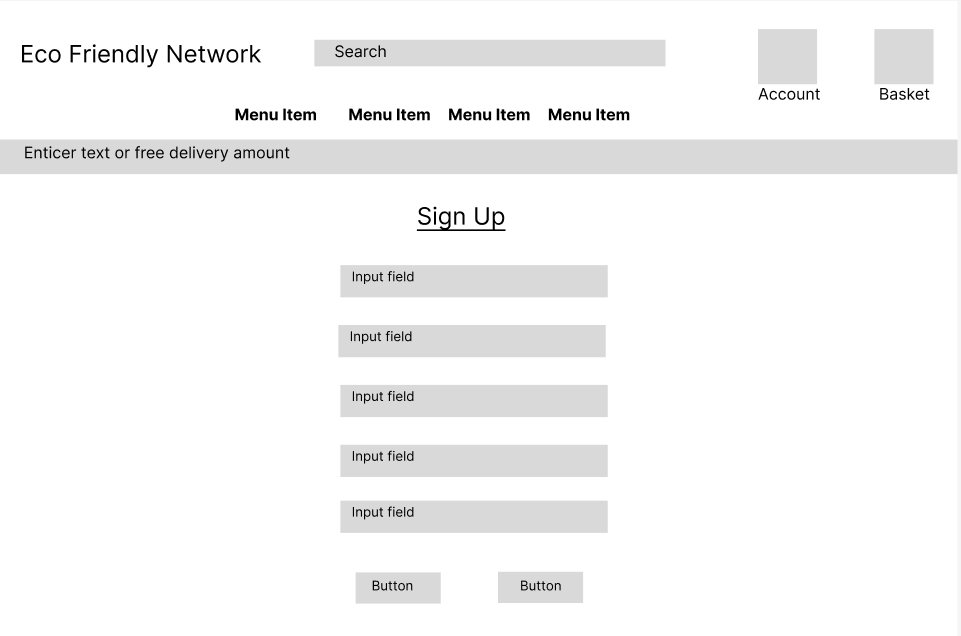

# [Eco Friendly network](https://ecofriendlynetwork-82b71b042579.herokuapp.com/)
An Eco friendly eccomerce store selling many diffent items. The website was created for people passionat about eco friendly living. The online shop offers products from different brands and it's aim is to encourage people to easy and friendly e-shopping.

**Code Institute - Milestone Project 4**

HTML / CSS / Python / Django / Jquery

By Joe Seabrook


## Strategy

### The 5 Planes

- **Purpose of the website?**
    
    Eco Friendly Network is an innovative e-commerce store dedicated to revolutionizing the way we approach consumerism, with a staunch commitment to environmental sustainability. Our platform's primary purpose is to bridge the gap between the growing demand for eco-friendly products and the global need for sustainable living practices. By meticulously curating a diverse range of environmentally responsible products, we aim to make sustainable choices readily accessible and convenient for everyone. Eco Friendly Network isn’t just about buying and selling; it's a catalyst for change, fostering a digital space where conscious consumerism thrives and where every transaction contributes positively to the wellbeing of our planet. Our focus lies in creating a seamless, informative, and empowering online shopping experience that aligns with the values of those who care deeply about their environmental footprint, thereby setting a new standard in the realm of eco-conscious e-commerce.

- **Target audience?**

    The Eco Friendly Network is specifically designed to cater to a diverse yet focused group of consumers who are united by their commitment to environmental sustainability. Our target audience encompasses:

    - **Environmentally Conscious Consumers:**
    
        Individuals who are actively seeking to reduce their ecological footprint through sustainable living choices. They prioritize products that are eco-friendly, ethically sourced, and have a minimal environmental impact.

    - **Eco-Friendly Lifestyle Adopters:**
    
        People who are in the process of transitioning to a more sustainable lifestyle. They are looking for accessible, affordable, and practical eco-friendly alternatives to everyday products.

    - **Ethical Shoppers:**
    
        Customers who make purchasing decisions based on the social and environmental impact of products. They support brands and platforms that align with their values of ethical production, fair trade, and responsible business practices.

    - **Tech-Savvy Shoppers:**
    
        A demographic that prefers the convenience of online shopping and is inclined towards platforms that offer a seamless, user-friendly digital experience.

    By understanding and catering to these key segments, Eco Friendly Network aims to create a meaningful impact in the sphere of sustainable consumerism, making it easy and appealing for individuals to make choices that are good for them and the planet.

- **Value to the user?**

    Eco Friendly Network provides distinct value to our users through our focused selection of eco-friendly personal accessories and home essentials. Here's how we deliver value:

    - **Curated Eco-Friendly Selection:**

        Our platform specializes in a carefully chosen range of sustainable products, specifically in personal accessories like watches, bracelets, sunglasses, and home essentials in kitchenware, and bath & beauty products. This focus ensures that every item we offer aligns with eco-conscious values and practices.

    - **Quality and Sustainability:**
    
        Each product in our collection is selected for its quality and sustainable attributes. Whether it's a bamboo watch or a biodegradable beauty product, we ensure that our items meet high standards of both functionality and eco-friendliness.

    - **Personal Accessory and Home Essential Focus:**
    
        By specializing in specific categories, we provide users with a targeted shopping experience. Our range of personal accessories and home essentials caters to everyday needs, ensuring that users can easily incorporate sustainability into their daily lives.

    - **Contribution to a Greener Future:**
    
        Every purchase made on our platform is a step towards a more sustainable future. Users are not just buying a product; they are making a conscious choice to support environmentally friendly practices and reduce their ecological footprint.

    - **What makes a good experience ?**
    
        At Eco Friendly Network, we believe that a good user experience is fundamental to our mission and success. Here are the key elements that we focus on to ensure a positive and memorable experience for our users:

    - **Intuitive Navigation and Design:**
    
        A clean, user-friendly website design is crucial. Our platform is structured for ease of navigation, allowing users to effortlessly browse through categories of personal accessories, kitchen items, and bath & beauty products. This straightforward approach helps users find what they're looking for without hassle.

    - **High-Quality Product Imagery and Descriptions:**
    
        We understand the importance of accurately representing our products. High-resolution images and detailed descriptions give users a clear understanding of what they are purchasing, aiding in making informed decisions.

    - **Secure and Efficient Checkout Process:**
    
        A smooth and secure checkout process is vital. We employ robust security measures to protect user data, coupled with an efficient checkout process to make transactions quick and hassle-free.

- **What we shouldn't do?**

    In our pursuit to offer an exceptional and sustainable shopping experience at Eco Friendly Network, there are certain practices we consciously avoid:

    - **Overwhelming Our Users:**
    
        We steer clear of cluttering our platform with excessive product options or information. Keeping our range focused and our presentation clean ensures users can find what they need without feeling overwhelmed.

    - **Undermining Privacy and Security:**
    
        We do not compromise on the privacy and security of our user data. Avoiding practices that could put user information at risk is a top priority.

    - **Inconsistency in Values:**
    
        We avoid stocking products that don't align with our core values of sustainability and ethical responsibility. Every item we sell must contribute positively to our mission.

    - **Inadequate Product Descriptions and Imagery:**
    
        We avoid vague descriptions and low-quality images. Clear, accurate, and detailed product presentations are crucial for informed purchasing decisions.

    - **Making False Claims:**
    
        We strictly avoid exaggerating or misrepresenting the sustainability of our products. Honesty and transparency in how products are sourced and their impact are paramount.

    By consciously steering clear of these practices, Eco Friendly Network aims to build trust, ensure user satisfaction, and uphold our commitment to promoting sustainable consumer choices.

### The Why

Eco Friendly Network was born out of a recognition of the urgent need for sustainable consumer habits in our daily lives. In a world increasingly burdened by environmental challenges, we understand the powerful role that individual choices can play. Our platform bridges the gap between eco-conscious consumers and high-quality, sustainable products. We believe that making environmentally responsible choices should be straightforward and rewarding. By offering a curated selection of personal accessories and home essentials, we demonstrate that living sustainably does not mean compromising on style or quality. Eco Friendly Network is committed to showing that a sustainable lifestyle can be accessible, desirable, and a positive force for change in the world.

### The Business Goal

Our primary business goal at Eco Friendly Network is to establish and grow as a leading online destination for sustainable personal accessories and home essentials. We aim to achieve this by:

- **Expanding Our Product Range:**

    Continuously broadening our selection of high-quality, eco-friendly products to meet the evolving needs and preferences of our customers.

- **Building Customer Loyalty:**

    Fostering strong relationships with our customers through exceptional service, reliability, and a deep understanding of their sustainable living goals.

- **Promoting Sustainability:**

    Actively contributing to the global movement towards environmental sustainability through our business practices and product offerings.

- **Achieving Financial Sustainability:**

    Ensuring the business is financially robust and growing, allowing us to invest further in our mission and expand our impact.

In essence, our goal is to seamlessly blend commercial success with our commitment to sustainability, creating a platform where conscious consumerism is not just encouraged, but celebrated.

## UX
### Color Scheme

I researched colour schemes on [ShutterStock](https://www.shutterstock.com/blog/sustainable-design-color-palettes). I decided to choose their pre-made "Clean Living theme(as seen below)


### Color by color:

 - **Sage Green**


     - Connection with Nature: Green hues are typically linked with nature, suggesting a sense of growth, renewal, and life. This particular shade of green, reminiscent of natural foliage, can evoke feelings of being grounded and connected to the natural world.

     - Balance and Harmony: Green is considered a color of balance and harmony, derived from its position in the color spectrum being in the middle of warm and cool tones. This shade of sage green, with its balanced mix of green and gray, can reinforce these qualities.

     - Health and Wellness: Often, green is associated with health and wellness. This might be due to its prevalent presence in healthy natural foods and its representation of vitality and freshness.

     - Sophistication and Elegance: The muted quality of this sage green can impart a sense of sophistication and understated elegance. It's often used in interior design to create a chic, yet calming atmosphere.

     - Subtlety and Softness: Unlike brighter or darker greens, this shade is more subtle and soft, which can create a more welcoming and less overwhelming space. It's often favored in design for its versatility and gentle appearance.

- **Tangerine**


    - Energy and Enthusiasm: Bright orange hues are often associated with energy, vibrancy, and excitement. They tend to evoke feelings of enthusiasm and can stimulate activity and social interaction.

    - Attention-Grabbing: Due to its high visibility, orange is used to catch attention and highlight the most important elements in a design. It can be used effectively to draw focus or emphasize key points.

    - Optimism and Positivity: Like other warm colors, orange is often linked with positivity and optimism. It's a color that can uplift moods and bring a sense of brightness and cheerfulness.

    - Creativity and Playfulness: Orange is considered a color that stimulates creativity and playfulness. It's seen as a fun, lively color that can encourage spontaneous and unconventional thinking.

- **Peach**


    - Youthfulness: Peach, with its soft and gentle tone, can convey a sense of playfulness and youthfulness. It's often associated with the play and innocence of childhood.

    - Gentleness and Soothing Quality: Unlike more saturated oranges, peach's muted quality gives it a more soothing presence. It's less stimulating and more calming, making it suitable for places where relaxation is key.

    - Nourishment and Comfort: Similar to other warm tones, peach can evoke a sense of nourishment and care, partly because of its resemblance to natural, healthy foods.

- **Silver Grey**


    - Neutrality and Balance: Gray is often considered a neutral and balanced color. It doesn't evoke strong emotions, making it a stable and calming presence in design and environment.

    - Modern and Sophisticated: Light gray is frequently associated with modernity and sophistication. It's commonly used in minimalist and contemporary designs, reflecting a sense of sleekness and refined taste.

    - Practicality and Timelessness: Being a classic and practical color, light gray is seen as timeless. It doesn’t go out of style and can be easily integrated into various contexts and design themes.

It's important to note that the psychological impact of color is highly subjective and can vary based on cultural, personal, and situational factors. The interpretation of colors can differ greatly from person to person.

### Typography
I researched sustainable fonts on [Coconut Design](https://coconutdesign.eu/sustainable-website-fonts-and-the-proper-use-of-them/).

#### Headings & Logo Font


I chose Allan as my Headings font. This font appealed to me due to its many characteristics and psychological impacts, Including:

- **Bold and Assertive:** Allan is known for its bold strokes, making it assertive and attention-grabbing. This feature is excellent for headings as it draws the reader's eye and establishes a hierarchy in the text.

- **Friendly and Approachable:** Despite its boldness, Allan has a certain roundness and softness to its characters, which can convey a sense of friendliness and approachability. This can make your content feel more inviting to readers.

- **Modern with a Touch of Playfulness:** The font has a modern look with a slight touch of playfulness. This can be great for engaging a wide range of audiences without being too formal or too casual.

- **Excellent Readability:** Allan maintains high readability even in larger sizes, which is crucial for headings. This ensures that titles are easily legible, enhancing the overall user experience and facilitating better content navigation.

- **Aesthetic Appeal:** The stylistic flair of Allan adds a visual interest to the headings, contributing to the overall aesthetic appeal of the web Application.

#### Body Text


I chose Roboto for body text due suitable contrast to the Allan Headings, As well as its versatile characteristics and psychological impacts, including:

- **Clarity and Readability:** Roboto is renowned for its high legibility, which is essential for body text. Its clean and unambiguous letterforms ensure that content is easily readable, even in smaller sizes or dense paragraphs.

- **Modern and Minimalist Design:** With its geometric forms and open curves, Roboto has a modern and minimalist aesthetic. This design complements contemporary layouts and interfaces, providing a sleek and up-to-date look.

- **Subtle Personality:** Unlike more decorative fonts, Roboto offers a subtle personality that doesn't overpower the content. Its character lies in its functionality, supporting the text rather than taking center stage.

- **Enhancing User Experience:** Given its legibility and aesthetic neutrality, Roboto enhances the user experience by making the reading process effortless and pleasant, which is crucial for engaging and retaining the audience.

All of my fonts were provided by [Google Fonts](https://fonts.google.com/)

As a best practice, I have also included Sans Serif as a fallback font in The design. In cases where browsers or devices may not support the specific fonts mentioned above, we use a generic sans-serif font. This ensures that the text remains legible and maintains a consistent appearance across various platforms.

## User Stories
### As a new user....

- I want to easily navigate the website, so that I can find the products I'm interested in without confusion.

- I want to see clear product descriptions and images, so that I know exactly what I'm buying.

-  I want to easily create an account, so that I can manage my orders and save my preferences.

- I want to learn about the sustainability of the products, so that I can make informed decisions about my purchases.

- I want a seamless and secure checkout process, so I can complete my purchase efficiently.

### As a returning user....

-  I want to be able to manage a user account and track my orders.

- I want the website to be responsive and user-friendly on my smartphone or tablet, so I can shop conveniently on the go.

-  I want to receive updates on promotions, new eco-friendly products, and sustainability initiatives, so I can stay engaged with the brand.

### As a site Admin.....

- I want to easily update product listings and information, so that the website stays current and accurate.

- I want to implement effective marketing strategies, so that I can attract new customers and retain existing ones.

## Wireframes

- **Home page**

    - Mobile

    

    - Tablet

    

    - Desktop

    

- **Product page**

    - Mobile

    

    - Tablet

    

    - Desktop 

    

- **Sign up page**

    - Mobile

    

    - Tablet

    

    - Desktop

    

## High Fidelity Prototype

## Features
### Existing Features

### Future Features

## Database Design

## CRUD Functionality
### Sales Stats

- **Sales Statistics(Admin Only)**
	- **Read Sales Stats (R):**
		- **Function:** sales_stats
		- **Description:** Displays sales statistics for products within a certain date range and optionally filtered by product and category.
		- **HTTP Method:** GET
		- **Database Operation:** Retrieves and computes sales data using aggregation functions on Product and OrderLineItem models.

- **Order Managment(Admin Only)**
	- **Read Orders (R):**
		- **Function:** manage_orders
		- **Description:** Displays and filters orders based on search criteria such as order number, username, and postcode.
		- **HTTP Method:** GET
		- **Database Operation:** Retrieves orders from the Order model based on the applied filters.

	- **Read Order Detail (R):**
		- **Function:** order_detail
		- **Description:** Displays the details of a specific order.
		- **HTTP Method:** GET
		- **Database Operation:** Retrieves a single Order instance by ID.

### User Profiles

- **User Profile Management:**
	- **Read Profile (R):**
		- **Function:** profile
		- **Description:** Displays the user's profile and order history.
		- **HTTP Method:** GET
		- **Database Operation:** Retrieves UserProfile instance and related - Order instances.
	- **Update Profile (U):**
		- **Function:** profile (on POST request)
		- **Description:** Allows users to update their profile information.
		- **HTTP Method:** POST
		- **Database Operation:** Updates the user's UserProfile instance in the database.
	- **Read Order History (R):**
		- **Function:** order_history
		- **Description:** Displays a user's past order confirmation for a specific order.
		- **HTTP Method:** GET
		- **Database Operation:** Retrieves a single Order instance by order number.

### Products and Favorites

- **Product Management:**
	- **Read Products (R):**
		- **Function:** all_products
		- **Description:** Displays all products, optionally sorted and filtered.
		- **HTTP Method:** GET
		- **Database Operation:** Retrieves Product instances, possibly with sorting 	and 	filtering based on query parameters.
	- **Read Product Detail (R):**
		- **Function:** product_detail
		- **Description:** Displays the details of an individual product.
		- **HTTP Method:** GET
		- **Database Operation:** Retrieves a single Product instance by ID.
	- **Create Product (C):**
		- **Function:** add_product
		- **Description:** Adds a new product to the store.
		- **HTTP Method:** POST
		- **Database Operation:** Inserts a new Product instance into the database.
	- **Update Product (U):**
		- **Function:** edit_product
		- **Description:** Edits an existing product in the store.
		- **HTTP Method:** POST
		- **Database Operation:** Updates a Product instance in the database.
	- **Delete Product (D):**
		- **Function:** delete_product
		- **Description:** Deletes a product from the store.
		- **HTTP Method:** POST
		- **Database Operation:** Removes a Product instance from the database.

- **Favorite Products (User-specific):**
	- **Create Favorite (C):**
		- **Function:** add_to_favorites
		- **Description:** Adds a product to the user's favorites.
		- **HTTP Method:** POST
		- **Database Operation:** Creates a new Favorite instance linking the user to a product.
	- **Read Favorites (R):**
		- **Function:** user_favorites
		- **Description:** Displays the user's favorite products.
		- **HTTP Method:** GET
		- **Database Operation:** Retrieves Favorite instances related to the user.
	- **Delete Favorite (D):**
		- **Function:** remove_from_favorites
		- **Description:** Removes a product from the user's favorites.
		- **HTTP Method:** POST
		- **Database Operation:** Deletes a Favorite instance from the database.

### Checkout

- **Checkout Process:**
	- **Create Order (C):**
		- **Function:** checkout
		- **Description:** Processes user's bag and payment information to create an order.
		- **HTTP Method:** POST
		- **Database Operation:** Inserts a new Order instance and related OrderLineItem instances into the database.
	- **Read Checkout Success (R):**
		- **Function:** checkout_success
		- **Description:** Displays a success message and order details post-checkout.
		- **HTTP Method:** GET
		- **Database Operation:** Retrieves an Order instance by order number.

### Blog

- **Blog Post Management:**
	- **Read Blog List (R):**
		- **Function:** blog_list
		- **Description:** Displays a list of all blog posts.
		- **HTTP Method:** GET
		- **Database Operation:** Retrieves Post instances from the database.
	- **Read Blog Detail (R):**
		- **Function:** blog_detail
		- **Description:** Displays the details of a specific blog post.
		- **HTTP Method:** GET
		- **Database Operation:** Retrieves a single Post instance by primary key.
	- **Create Blog Post (C):**
		- **Function:** add_post
		- **Description:** Adds a new blog post to the blog.
		- **HTTP Method:** POST
		- **Database Operation:** Inserts a new Post instance into the database.
	- **Update Blog Post (U):**
		- **Function:** edit_post
		- **Description:** Edits an existing blog post.
		- **HTTP Method:** POST
		- **Database Operation:** Updates a Post instance in the database.
	- **Delete Blog Post (D):**
		- **Function:** delete_post
		- **Description:** Deletes a blog post.
		- **HTTP Method:** POST
		- **Database Operation:** Removes a Post instance from the database.

- **Favorite Blog Posts (User-specific):**
	- **Create Favorite Post (C):**
		- **Function:** add_to_favorite_posts
		- **Description:** Adds a blog post to the user's list of favorite posts.
		- **HTTP Method:** POST
		- **Database Operation:** Updates the Favorite instance to add a Post instance.
	- **Read Favorite Posts (R):**
		- **Function:** favorite_posts_list
		- **Description:** Displays the user's favorite blog posts.
		- **HTTP Method:** GET
		- **Database Operation:** Retrieves Favorite instances related to the user and the related Post instances.
	- **Delete Favorite Post (D):**
		- **Function:** remove_from_favorite_posts
		- **Description:** Removes a blog post from the user's list of favorite posts.
		- **HTTP Method:** POST
		- **Database Operation:** Updates the Favorite instance to remove a Post instance.


## **TESTING**
For the documentation of all testing,Please see [TESTING.md](TESTING.md) 

## Deployment
The live deployed application can be found deployed on [Heroku](https://ecofriendlynetwork-82b71b042579.herokuapp.com).

### ElephantSQL Database

This project uses [ElephantSQL](https://www.elephantsql.com) for the PostgreSQL Database.

To obtain your own Postgres Database, sign-up with your GitHub account, then follow these steps:

- Click **Create New Instance** to start a new database.
- Provide a name (this is commonly the name of the project: ecofriendlynetwork).
- Select the **Tiny Turtle (Free)** plan.
- You can leave the **Tags** blank.
- Select the **Region** and **Data Center** closest to you.
- Once created, click on the new database name, where you can view the database URL and Password.

### Amazon AWS

This project uses [AWS](https://aws.amazon.com) to store media and static files online, due to the fact that Heroku doesn't persist this type of data.

Once you've created an AWS account and logged-in, follow these series of steps to get your project connected.
Make sure you're on the **AWS Management Console** page.

#### S3 Bucket

- Search for **S3**.
- Create a new bucket, give it a name (matching your Heroku app name), and choose the region closest to you.
- Uncheck **Block all public access**, and acknowledge that the bucket will be public (required for it to work on Heroku).
- From **Object Ownership**, make sure to have **ACLs enabled**, and **Bucket owner preferred** selected.
- From the **Properties** tab, turn on static website hosting, and type `index.html` and `error.html` in their respective fields, then click **Save**.
- From the **Permissions** tab, paste in the following CORS configuration:

	```shell
	[
		{
			"AllowedHeaders": [
				"Authorization"
			],
			"AllowedMethods": [
				"GET"
			],
			"AllowedOrigins": [
				"*"
			],
			"ExposeHeaders": []
		}
	]
	```

- Copy your **ARN** string.
- From the **Bucket Policy** tab, select the **Policy Generator** link, and use the following steps:
	- Policy Type: **S3 Bucket Policy**
	- Effect: **Allow**
	- Principal: `*`
	- Actions: **GetObject**
	- Amazon Resource Name (ARN): **paste-your-ARN-here**
	- Click **Add Statement**
	- Click **Generate Policy**
	- Copy the entire Policy, and paste it into the **Bucket Policy Editor**

		```shell
		{
			"Id": "Policy1234567890",
			"Version": "2012-10-17",
			"Statement": [
				{
					"Sid": "Stmt1234567890",
					"Action": [
						"s3:GetObject"
					],
					"Effect": "Allow",
					"Resource": "arn:aws:s3:::your-bucket-name/*"
					"Principal": "*",
				}
			]
		}
		```

	- Before you click "Save", add `/*` to the end of the Resource key in the Bucket Policy Editor (like above).
	- Click **Save**.
- From the **Access Control List (ACL)** section, click "Edit" and enable **List** for **Everyone (public access)**, and accept the warning box.
	- If the edit button is disabled, you need to change the **Object Ownership** section above to **ACLs enabled** (mentioned above).

#### IAM

Back on the AWS Services Menu, search for and open **IAM** (Identity and Access Management).
Once on the IAM page, follow these steps:

- From **User Groups**, click **Create New Group**.
	- Suggested Name: `group-ecofriendlynetwork` (group + the project name)
- Tags are optional, but you must click it to get to the **review policy** page.
- From **User Groups**, select your newly created group, and go to the **Permissions** tab.
- Open the **Add Permissions** dropdown, and click **Attach Policies**.
- Select the policy, then click **Add Permissions** at the bottom when finished.
- From the **JSON** tab, select the **Import Managed Policy** link.
	- Search for **S3**, select the `AmazonS3FullAccess` policy, and then **Import**.
	- You'll need your ARN from the S3 Bucket copied again, which is pasted into "Resources" key on the Policy.

		```shell
		{
			"Version": "2012-10-17",
			"Statement": [
				{
					"Effect": "Allow",
					"Action": "s3:*",
					"Resource": [
						"arn:aws:s3:::your-bucket-name",
						"arn:aws:s3:::your-bucket-name/*"
					]
				}
			]
		}
		```
	
	- Click **Review Policy**.
	- Suggested Name: `policy-ecofriendlynetwork` (policy + the project name)
	- Provide a description:
		- "Access to S3 Bucket for ecofriendlynetwork static files."
	- Click **Create Policy**.
- From **User Groups**, click your "group-ecofriendlynetwork".
- Click **Attach Policy**.
- Search for the policy you've just created ("policy-ecofriendlynetwork") and select it, then **Attach Policy**.
- From **User Groups**, click **Add User**.
	- Suggested Name: `user-ecofriendlynetwork` (user + the project name)
- For "Select AWS Access Type", select **Programmatic Access**.
- Select the group to add your new user to: `group-ecofriendlynetwork`
- Tags are optional, but you must click it to get to the **review user** page.
- Click **Create User** once done.
- You should see a button to **Download .csv**, so click it to save a copy on your system.
	- **IMPORTANT**: once you pass this page, you cannot come back to download it again, so do it immediately!
	- This contains the user's **Access key ID** and **Secret access key**.
	- `AWS_ACCESS_KEY_ID` = **Access key ID**
	- `AWS_SECRET_ACCESS_KEY` = **Secret access key**

#### Final AWS Setup

- If Heroku Config Vars has `DISABLE_COLLECTSTATIC` still, this can be removed now, so that AWS will handle the static files.
- Back within **S3**, create a new folder called: `media`.
- Select any existing media images for your project to prepare them for being uploaded into the new folder.
- Under **Manage Public Permissions**, select **Grant public read access to this object(s)**.
- No further settings are required, so click **Upload**.

### Stripe API

This project uses [Stripe](https://stripe.com) to handle the ecommerce payments.

Once you've created a Stripe account and logged-in, follow these series of steps to get your project connected.

- From your Stripe dashboard, click to expand the "Get your test API keys".
- You'll have two keys here:
	- `STRIPE_PUBLIC_KEY` = Publishable Key (starts with **pk**)
	- `STRIPE_SECRET_KEY` = Secret Key (starts with **sk**)

As a backup, in case users prematurely close the purchase-order page during payment, we can include Stripe Webhooks.

- From your Stripe dashboard, click **Developers**, and select **Webhooks**.
- From there, click **Add Endpoint**.
	- `https://ecofriendlynetwork-82b71b042579.herokuapp.com/checkout/wh/`
- Click **receive all events**.
- Click **Add Endpoint** to complete the process.
- You'll have a new key here:
	- `STRIPE_WH_SECRET` = Signing Secret (Wehbook) Key (starts with **wh**)

### Gmail API

This project uses [Gmail](https://mail.google.com) to handle sending emails to users for account verification and purchase order confirmations.

Once you've created a Gmail (Google) account and logged-in, follow these series of steps to get your project connected.

- Click on the **Account Settings** (cog icon) in the top-right corner of Gmail.
- Click on the **Accounts and Import** tab.
- Within the section called "Change account settings", click on the link for **Other Google Account settings**.
- From this new page, select **Security** on the left.
- Select **2-Step Verification** to turn it on. (verify your password and account)
- Once verified, select **Turn On** for 2FA.
- Navigate back to the **Security** page, and you'll see a new option called **App passwords**.
- This might prompt you once again to confirm your password and account.
- Select **Mail** for the app type.
- Select **Other (Custom name)** for the device type.
	- Any custom name, such as "Django" or ecofriendlynetwork
- You'll be provided with a 16-character password (API key).
	- Save this somewhere locally, as you cannot access this key again later!
	- `EMAIL_HOST_PASS` = user's 16-character API key
	- `EMAIL_HOST_USER` = user's own personal Gmail email address

### Heroku Deployment

This project uses [Heroku](https://www.heroku.com), a platform as a service (PaaS) that enables developers to build, run, and operate applications entirely in the cloud.

Deployment steps are as follows, after account setup:

- Select **New** in the top-right corner of your Heroku Dashboard, and select **Create new app** from the dropdown menu.
- Your app name must be unique, and then choose a region closest to you (EU or USA), and finally, select **Create App**.
- From the new app **Settings**, click **Reveal Config Vars**, and set your environment variables.

| Key | Value |
| --- | --- |
| `AWS_ACCESS_KEY_ID` | user's own value |
| `AWS_SECRET_ACCESS_KEY` | user's own value |
| `DATABASE_URL` | user's own value |
| `DISABLE_COLLECTSTATIC` | 1 (*this is temporary, and can be removed for the final deployment*) |
| `EMAIL_HOST_PASS` | user's own value |
| `EMAIL_HOST_USER` | user's own value |
| `SECRET_KEY` | user's own value |
| `STRIPE_PUBLIC_KEY` | user's own value |
| `STRIPE_SECRET_KEY` | user's own value |
| `STRIPE_WH_SECRET` | user's own value |
| `USE_AWS` | True |

Heroku needs two additional files in order to deploy properly.

- requirements.txt
- Procfile

You can install this project's **requirements** (where applicable) using:

- `pip3 install -r requirements.txt`

If you have your own packages that have been installed, then the requirements file needs updated using:

- `pip3 freeze --local > requirements.txt`

The **Procfile** can be created with the following command:

- `echo web: gunicorn app_name.wsgi > Procfile`
- *replace **app_name** with the name of your primary Django app name; the folder where settings.py is located*

For Heroku deployment, follow these steps to connect your own GitHub repository to the newly created app:

Either:

- Select **Automatic Deployment** from the Heroku app.

Or:

- In the Terminal/CLI, connect to Heroku using this command: `heroku login -i`
- Set the remote for Heroku: `heroku git:remote -a app_name` (replace *app_name* with your app name)
- After performing the standard Git `add`, `commit`, and `push` to GitHub, you can now type:
	- `git push heroku main`

The project should now be connected and deployed to Heroku!

### Local Deployment

This project can be cloned or forked in order to make a local copy on your own system.

For either method, you will need to install any applicable packages found within the *requirements.txt* file.

- `pip3 install -r requirements.txt`.

You will need to create a new file called `env.py` at the root-level,
and include the same environment variables listed above from the Heroku deployment steps.

Sample `env.py` file:

```python
import os

os.environ.setdefault("AWS_ACCESS_KEY_ID", "user's own value")
os.environ.setdefault("AWS_SECRET_ACCESS_KEY", "user's own value")
os.environ.setdefault("DATABASE_URL", "user's own value")
os.environ.setdefault("EMAIL_HOST_PASS", "user's own value")
os.environ.setdefault("EMAIL_HOST_USER", "user's own value")
os.environ.setdefault("SECRET_KEY", "user's own value")
os.environ.setdefault("STRIPE_PUBLIC_KEY", "user's own value")
os.environ.setdefault("STRIPE_SECRET_KEY", "user's own value")
os.environ.setdefault("STRIPE_WH_SECRET", "user's own value")

# local environment only (do not include these in production/deployment!)
os.environ.setdefault("DEBUG", "True")
```

Once the project is cloned or forked, in order to run it locally, you'll need to follow these steps:

- Start the Django app: `python3 manage.py runserver`
- Stop the app once it's loaded: `CTRL+C` or `⌘+C` (Mac)
- Make any necessary migrations: `python3 manage.py makemigrations`
- Migrate the data to the database: `python3 manage.py migrate`
- Create a superuser: `python3 manage.py createsuperuser`
- Load fixtures (if applicable): `python3 manage.py loaddata file-name.json` (repeat for each file)
- Everything should be ready now, so run the Django app again: `python3 manage.py runserver`

If you'd like to backup your database models, use the following command for each model you'd like to create a fixture for:

- `python3 manage.py dumpdata your-model > your-model.json`
- *repeat this action for each model you wish to backup*

#### Cloning

You can clone the repository by following these steps:

1. Go to the [GitHub repository](https://github.com/Jaycode88/ecofriendlynetwork) 
2. Locate the Code button above the list of files and click it 
3. Select if you prefer to clone using HTTPS, SSH, or GitHub CLI and click the copy button to copy the URL to your clipboard
4. Open Git Bash or Terminal
5. Change the current working directory to the one where you want the cloned directory
6. In your IDE Terminal, type the following command to clone my repository:
	- `git clone https://github.com/Jaycode88/ecofriendlynetwork.git`
7. Press Enter to create your local clone.

Alternatively, if using Gitpod, you can click below to create your own workspace using this repository.

[](https://gitpod.io/#https://github.com/Jaycode88/ecofriendlynetwork)

Please note that in order to directly open the project in Gitpod, you need to have the browser extension installed.
A tutorial on how to do that can be found [here](https://www.gitpod.io/docs/configure/user-settings/browser-extension).

#### Forking

By forking the GitHub Repository, we make a copy of the original repository on our GitHub account to view and/or make changes without affecting the original owner's repository.
You can fork this repository by using the following steps:

1. Log in to GitHub and locate the [GitHub Repository](https://github.com/Jaycode88/ecofriendlynetwork)
2. At the top of the Repository (not top of page) just above the "Settings" Button on the menu, locate the "Fork" Button.
3. Once clicked, you should now have a copy of the original repository in your own GitHub account!

### Local VS Deployment

When working with this project, it's important to understand the differences between running the application locally and deploying it to Heroku:

Local Development: Running the application locally is ideal for development and testing purposes. You can make changes, test new features, and experiment with the code in a controlled environment.

Heroku Deployment: Deploying the application to Heroku makes it accessible to a wider audience on the web. It's suitable for sharing your project with others and providing a public URL for access.

Choose the deployment option that best suits your needs and project goals.

Always follow the steps and ensure that your sensitive information(API Keys, Database credentials, etc) are not visible to the public.

## Credits
### Content

### Media
The home page image was from [Freepik](https://www.freepik.com/) by [jcomp](https://www.freepik.com/author/jcomp)

### Tools and Technologies used

### Acknowledgements