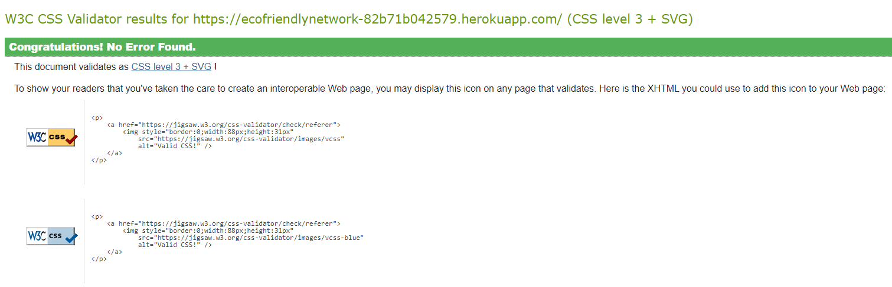

# Testing
Return back to the [README.md](README.md) file.

I have used various tools to Test Funcionality, Validity and responsiveness. I have been sure to check all layouts, colours, text, forms, links, buttons are functioning on all devices and screen sizes that I have tested.

## Code Validation

### HTML

I have used the recommended [HTML W3C Validator](https://validator.w3.org) to validate all of my HTML files. I checked validated by both URI and Copying and pasting the rendered page's source code into the checker.

- **Results:**

    - [Home](https://validator.w3.org/nu/?doc=https%3A%2F%2Fecofriendlynetwork-82b71b042579.herokuapp.com%2F)
    

    - [Sign Up](To be checked)

    - [Sign In](https://validator.w3.org/nu/?doc=https%3A%2F%2Fecofriendlynetwork-82b71b042579.herokuapp.com%2Faccounts%2Flogin%2F)
    

    - [Products](https://validator.w3.org/nu/?doc=https%3A%2F%2Fecofriendlynetwork-82b71b042579.herokuapp.com%2Fproducts%2F)
    

    - [Product Detail](https://validator.w3.org/nu/?doc=https%3A%2F%2Fecofriendlynetwork-82b71b042579.herokuapp.com%2Fproducts%2F1%2F)
    

    - [Blog](https://validator.w3.org/nu/?doc=https%3A%2F%2Fecofriendlynetwork-82b71b042579.herokuapp.com%2Fblog%2F)
    

    - [Blog Detail](https://validator.w3.org/nu/?doc=https%3A%2F%2Fecofriendlynetwork-82b71b042579.herokuapp.com%2Fblog%2F3%2F)
    

### CSS

I have used the recommended [CSS Jigsaw Validator](https://jigsaw.w3.org/css-validator) to validate all of my CSS files.

- link to results: [click here](https://jigsaw.w3.org/css-validator/validator?uri=https%3A%2F%2Fecofriendlynetwork-82b71b042579.herokuapp.com%2F&profile=css3svg&usermedium=all&warning=1&vextwarning=&lang=en)



### JavaScript

I have used the recommended [JShint Validator](https://jshint.com) to validate my JS files. I used version 11 which does not throw errors due to use of ES6 syntax, Aswell as informing JSHint that I was intenionally using jQuery. To do so I have added the following line to the top of my script.js file:
```
/* jshint esversion: 11, jquery: true */
```

### PEP8

I have used [Python Linter](https://pep8ci.herokuapp.com/) (Provided by CodeInstitute) to check all Python files are PEP8 compliant.

## Cross Platform Testing

### Browser Compatability
I've tested my deployed project on multiple browsers to check for compatibility issues.

### Responsiveness

### CRUD (create, read, update, delete) Testing

### Form Validation Testing

### LightHouse Testing

## Defensive Programming

## User Story Testing

## Automated Testing
### Jest Testing JQuery

#### Jest test Issues 

### Python unit testing

## Bugs
### Fixed Bugs
When Attempting to create the functionality for the shopping bag to be updated upon the click of the increment or decrement button being pushed rather than needing a submit button: I cam accross great difficulty in that when i was pressing the increment or decrement buttons the no. of items value would increment or decrement by 2 rather than 1 When i tried to fix this I would get varying results mainly the buttons not disabling and enabling correctly or the increment and decrements going in values of 2. After a lot of time debugging I realised it was due to using the quantity input script in the bag template as I was changing the function it was nessacerry to completely  rewrite the code for the bag template and leave the quantity input script for the product details page only.

## Unfixed Bugs