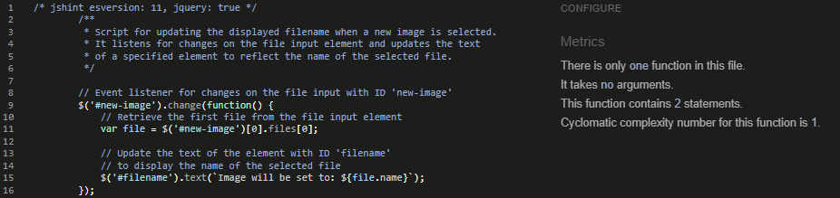

# Testing
Return back to the [README.md](README.md) file.

I have used various tools to Test Funcionality, Validity and responsiveness. I have been sure to check all layouts, colours, text, forms, links, buttons are functioning on all devices and screen sizes that I have tested.

## Code Validation

### HTML

I have used the recommended [HTML W3C Validator](https://validator.w3.org) to validate all of my HTML files. I checked validated by both URI and Copying and pasting the rendered page's source code into the checker.

- **Results:**

    - [Home](https://validator.w3.org/nu/?doc=https%3A%2F%2Fecofriendlynetwork-82b71b042579.herokuapp.com%2F)
    

    - [Sign Up](To be checked)

    - [Sign In](https://validator.w3.org/nu/?doc=https%3A%2F%2Fecofriendlynetwork-82b71b042579.herokuapp.com%2Faccounts%2Flogin%2F)
    

    - [Products](https://validator.w3.org/nu/?doc=https%3A%2F%2Fecofriendlynetwork-82b71b042579.herokuapp.com%2Fproducts%2F)
    

    - [Product Detail](https://validator.w3.org/nu/?doc=https%3A%2F%2Fecofriendlynetwork-82b71b042579.herokuapp.com%2Fproducts%2F1%2F)
    

    - [Blog](https://validator.w3.org/nu/?doc=https%3A%2F%2Fecofriendlynetwork-82b71b042579.herokuapp.com%2Fblog%2F)
    

    - [Blog Detail](https://validator.w3.org/nu/?doc=https%3A%2F%2Fecofriendlynetwork-82b71b042579.herokuapp.com%2Fblog%2F3%2F)
    

    - [Profile](to discuss)

    - [Add Product](TBC)

    - [Edit Product](TBC)

### CSS

I have used the recommended [CSS Jigsaw Validator](https://jigsaw.w3.org/css-validator) to validate all of my CSS files.

- link to results: [click here](https://jigsaw.w3.org/css-validator/validator?uri=https%3A%2F%2Fecofriendlynetwork-82b71b042579.herokuapp.com%2F&profile=css3svg&usermedium=all&warning=1&vextwarning=&lang=en)


### JavaScript

I have used the recommended [JShint Validator](https://jshint.com) to validate my JS files. I used version 11 which does not throw errors due to use of ES6 syntax, Aswell as informing JSHint that I was intenionally using jQuery. To do so I have added the following line to the top of my script.js file:
```
/* jshint esversion: 11, jquery: true */
```

- **Results**

    - Countryfield.js
    

    - add_product.html
    

### PEP8

I have used [Python Linter](https://pep8ci.herokuapp.com/) (Provided by CodeInstitute) to check all Python files are PEP8 compliant.

## Cross Platform Testing

### Browser Compatability
I've tested my deployed project on multiple browsers to check for compatibility issues.

### Responsiveness

### CRUD (create, read, update, delete) Testing

### Form Validation Testing

### LightHouse Testing
I used Google Chrome Lighthouse testing to assess the quality of the web app.

| Page | Results desktop | Results mobile |
|------|-----------------|----------------|
|Home| |  |
|Sign Up| |  |
|Sign In| |  |
|Products||
|Product Detail| |  |
|Blog|
|Blog Detail|
|Profile|
|Shopping Bag|
|Checkout Page|
|Checkout Success|
|Add Product|
|Edit Product|
|Add Blog Post|
|Edit Blog Post|
|Order Stats|
|Product Stats|
|Log Out|
|Password reset|


## Defensive Programming

## User Story Testing

## Automated Testing
### Jest Testing JQuery

#### Jest test Issues 

### Python unit testing

## Bugs
### Fixed Bugs

- **Increment/Decrement Buttons**
    When Attempting to create the functionality for the shopping bag to be updated upon the click of the increment or decrement button being pushed rather than needing a submit button: I came accross great difficulty in that when i was pressing the increment or decrement buttons the no. of items value would increment or decrement by 2 rather than 1 When i tried to fix this I would get varying results mainly the buttons not disabling and enabling correctly or the increment and decrements going in values of 2. After a lot of time debugging I realised it was due to using the quantity input script in the bag template as I was changing the function it was nessacerry to completely  rewrite the code for the bag template and leave the quantity input script for the product details page only.

- **Custom Clearable file input**
    I was recieving the following error when attempting to load my add or edit product pages:
    
    I found it was due to line 43/44 in my checkouts webhooks.py I had attempted to seperate lines to comply with PEP8 but I found This effected the code so the line had to be complete as one with a # noqa after it.
    

- **Email Confirmation**
    I found that on my deployed site order confirmation emails were not being sent. After much time looking over code and not finding the issue my mentor suggested checking that the webhook endpoint was correct in my Stripe settings. My mentor was right my Stripe webhook endpoint was still set to my site preview rather than my deployed site.

- **Sales Stats Favorites Count**
    The application was displaying inconsistent counts of how many users had marked a product as a favorite in the sales_stats app compared to the products app. The sales_stats app's count of favorites per product was incorrect, potentially leading to misleading data representation in the sales statistics.

    The discrepancy was caused by the way the total_favorites was calculated in the sales_stats view. Initially, the count of favorites might have included duplicate counts or was affected by other filters applied to the sales data, such as date ranges.

    Therefore the line of code responsible for counting the total number of favorites for each product in the sales_stats view was modified:
    

## Unfixed Bugs