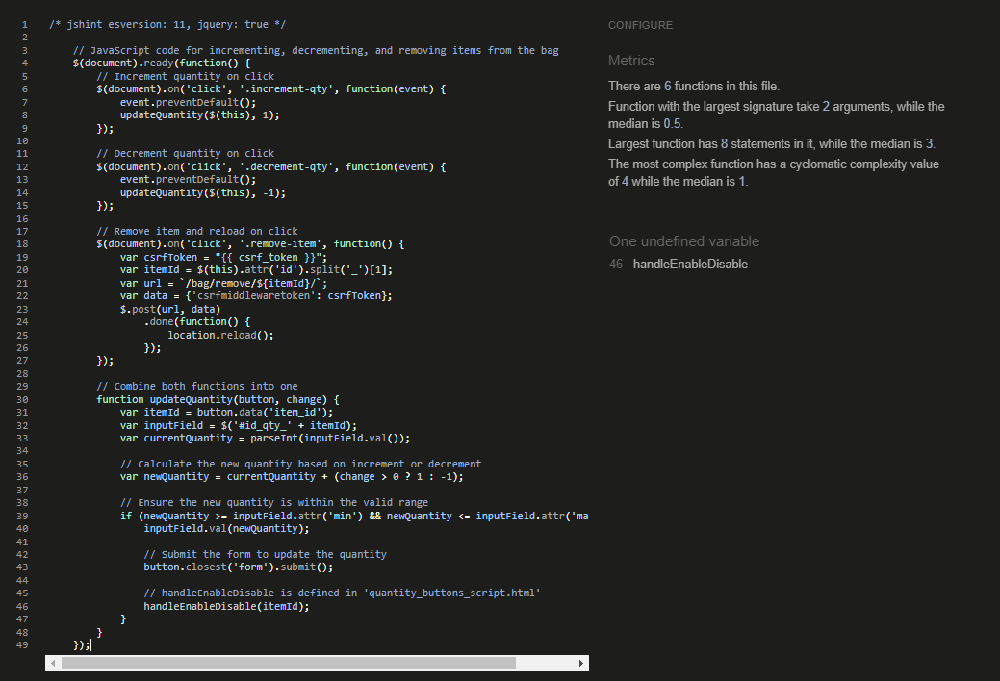
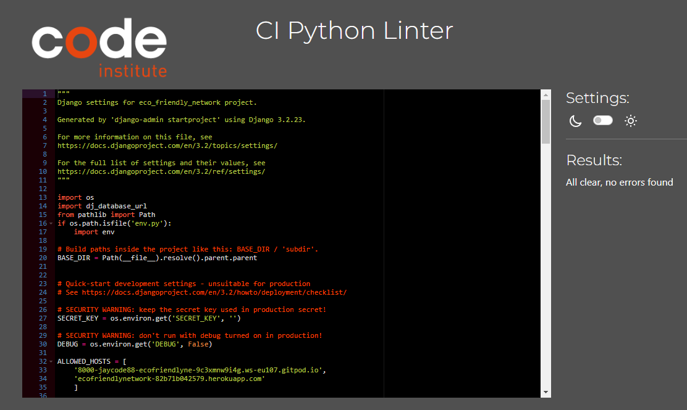
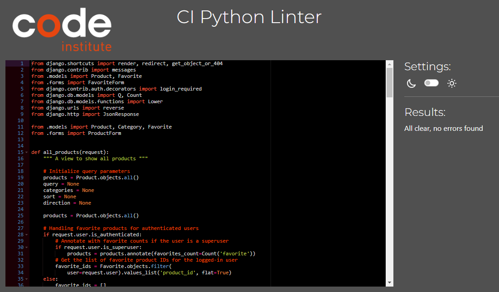
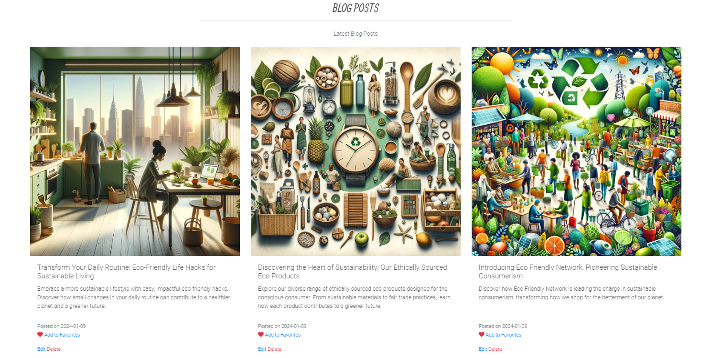

# Testing
Return back to the [README.md](README.md) file.

I have used various tools to Test Funcionality, Validity and responsiveness. I have been sure to check all layouts, colours, text, forms, links, buttons are functioning on all devices and screen sizes that I have tested.

## Code Validation

### HTML

I have used the recommended [HTML W3C Validator](https://validator.w3.org) to validate all of my HTML files. I checked validated by both URI and Copying and pasting the rendered page's source code into the checker.

- **Results:**

    - [Home](https://validator.w3.org/nu/?doc=https%3A%2F%2Fecofriendlynetwork-82b71b042579.herokuapp.com%2F)

        

    - [Sign Up](https://validator.w3.org/nu/?doc=https%3A%2F%2Fecofriendlynetwork-82b71b042579.herokuapp.com%2Faccounts%2Fsignup%2F)

        

    - [Sign In](https://validator.w3.org/nu/?doc=https%3A%2F%2Fecofriendlynetwork-82b71b042579.herokuapp.com%2Faccounts%2Flogin%2F)

        

    - [Products](https://validator.w3.org/nu/?doc=https%3A%2F%2Fecofriendlynetwork-82b71b042579.herokuapp.com%2Fproducts%2F)

        

    - [Product Detail](https://validator.w3.org/nu/?doc=https%3A%2F%2Fecofriendlynetwork-82b71b042579.herokuapp.com%2Fproducts%2F1%2F)

        

    - [Blog](https://validator.w3.org/nu/?doc=https%3A%2F%2Fecofriendlynetwork-82b71b042579.herokuapp.com%2Fblog%2F)

        

    - [Blog Detail](https://validator.w3.org/nu/?doc=https%3A%2F%2Fecofriendlynetwork-82b71b042579.herokuapp.com%2Fblog%2F3%2F)

        

    - [Profile](https://validator.w3.org/nu/?doc=https%3A%2F%2Fecofriendlynetwork-82b71b042579.herokuapp.com%2Fprofile%2F)

        

    - [Shopping Bag](https://validator.w3.org/nu/?doc=https%3A%2F%2Fecofriendlynetwork-82b71b042579.herokuapp.com%2Fbag%2F)

        

    - [Checkout](https://validator.w3.org/nu/?doc=https%3A%2F%2Fecofriendlynetwork-82b71b042579.herokuapp.com%2Fcheckout%2F)

        

    - [Checkout Success](https://validator.w3.org/nu/?doc=https%3A%2F%2Fecofriendlynetwork-82b71b042579.herokuapp.com%2Fcheckout%2Fcheckout_success%2FA44315E1218E45D3BD6F89C825B3791F)

        

    - [Add Product](https://validator.w3.org/nu/?doc=https%3A%2F%2Fecofriendlynetwork-82b71b042579.herokuapp.com%2Fproducts%2Fadd%2F)

        

    - [Edit Product](https://validator.w3.org/nu/?doc=https%3A%2F%2Fecofriendlynetwork-82b71b042579.herokuapp.com%2Fproducts%2Fedit%2F1)

        

    - [Add Blog Post](https://validator.w3.org/nu/?doc=https%3A%2F%2Fecofriendlynetwork-82b71b042579.herokuapp.com%2Fblog%2Fadd%2F)

        

    - [Edit Blog Post](https://validator.w3.org/nu/?doc=https%3A%2F%2Fecofriendlynetwork-82b71b042579.herokuapp.com%2Fblog%2Fedit%2F2)

        

    - [Order Stats](https://validator.w3.org/nu/?doc=https%3A%2F%2Fecofriendlynetwork-82b71b042579.herokuapp.com%2Fsales_stats%2Fmanage_orders%2F)

        

    - [Product Stats](https://validator.w3.org/nu/?doc=https%3A%2F%2Fecofriendlynetwork-82b71b042579.herokuapp.com%2Fsales_stats%2Fstats%2F)

        

    - [View Order](https://validator.w3.org/nu/?doc=https%3A%2F%2Fecofriendlynetwork-82b71b042579.herokuapp.com%2Fsales_stats%2Forder_detail%2F11%2F)

        

    - [Log Out](https://validator.w3.org/nu/?doc=https%3A%2F%2Fecofriendlynetwork-82b71b042579.herokuapp.com%2Faccounts%2Flogout%2F)

        

    - [Password Reset](https://validator.w3.org/nu/?doc=https%3A%2F%2Fecofriendlynetwork-82b71b042579.herokuapp.com%2Faccounts%2Fpassword%2Freset%2F)

        

on the Profile, Add Product, Edit Product, Add Blog, Edit Blog, Order Stats, Product Stats, View Order and Forgot Password pages you will see an info note in the validation results I have discussed this in the Unfixed Bugs section.

### CSS

I have used the recommended [CSS Jigsaw Validator](https://jigsaw.w3.org/css-validator) to validate all of my CSS files.

- **base.css**

    link to results: [click here](https://jigsaw.w3.org/css-validator/validator?uri=https%3A%2F%2Fecofriendlynetwork-82b71b042579.herokuapp.com%2F&profile=css3svg&usermedium=all&warning=1&vextwarning=&lang=en)

    

- **Profile.css**

    link to results:[click here](https://jigsaw.w3.org/css-validator/validator?uri=https%3A%2F%2Fecofriendlynetwork-82b71b042579.herokuapp.com%2F&profile=css3svg&usermedium=all&warning=1&vextwarning=&lang=en)

    

- **checkout.css**

    link to results:[click here](https://jigsaw.w3.org/css-validator/validator?uri=https%3A%2F%2Fecofriendlynetwork-82b71b042579.herokuapp.com%2Fcheckout%2F&profile=css3svg&usermedium=all&warning=1&vextwarning=&lang=en)

    

### JavaScript

I have used the recommended [JShint Validator](https://jshint.com) to validate my JS files. I used version 11 which does not throw errors due to use of ES6 syntax, Aswell as informing JSHint that I was intenionally using jQuery. To do so I have added the following line to the top of my scripts:
```
/* jshint esversion: 11, jquery: true */
```

- **Results**

    - Countryfield.js
    

    - sorting_select_box_script.js
    

    - proddetail_incdec_quantity_btn.js
    
    N.B The 'handleEnableDisable' Is defined in the 'enabledisable_buttons_script.js'(Below), Which is included in the 'product_detail.html'.

    - enabledisable_buttons_script.js
    

    - bag_incdec_remove.js
    
    N.B The 'handleEnableDisable' Is defined in the 'enabledisable_buttons_script.js'(Above), Which is included in the 'bag.html'. 

    - image_upload_preview_script.js
    

    - stripe_element.js
     


### PEP8

I have used [Python Linter](https://pep8ci.herokuapp.com/) (Provided by CodeInstitute) to check all Python files are PEP8 compliant.

| Directory | File | Results Link | Results image |
|--------|------|--------------|---------------|
**eco_friendly_network**
||wsgi.py|[view](https://pep8ci.herokuapp.com/https://raw.githubusercontent.com/Jaycode88/ecofriendlynetwork/main/eco_friendly_network/wsgi.py)||
||urls.py|[View](https://pep8ci.herokuapp.com/https://raw.githubusercontent.com/Jaycode88/ecofriendlynetwork/main/eco_friendly_network/urls.py)||
||settings.py|[view](https://pep8ci.herokuapp.com/https://raw.githubusercontent.com/Jaycode88/ecofriendlynetwork/main/eco_friendly_network/settings.py)||
||asgi.py|[View](https://pep8ci.herokuapp.com/https://raw.githubusercontent.com/Jaycode88/ecofriendlynetwork/main/eco_friendly_network/asgi.py)||
**home**
||views.py|[View](https://pep8ci.herokuapp.com/https://raw.githubusercontent.com/Jaycode88/ecofriendlynetwork/main/home/views.py)||
||urls.py|[View](https://pep8ci.herokuapp.com/https://raw.githubusercontent.com/Jaycode88/ecofriendlynetwork/main/home/urls.py)||
||apps.py|[View](https://pep8ci.herokuapp.com/https://raw.githubusercontent.com/Jaycode88/ecofriendlynetwork/main/home/apps.py)||
||tests.py|[View](https://pep8ci.herokuapp.com/https://raw.githubusercontent.com/Jaycode88/ecofriendlynetwork/main/home/tests.py)||
**products**
||widgets.py|[View](https://pep8ci.herokuapp.com/https://raw.githubusercontent.com/Jaycode88/ecofriendlynetwork/main/products/widgets.py)||
||views.py|[View](https://pep8ci.herokuapp.com/https://raw.githubusercontent.com/Jaycode88/ecofriendlynetwork/main/products/views.py)||
||urls.py|[View](https://pep8ci.herokuapp.com/https://raw.githubusercontent.com/Jaycode88/ecofriendlynetwork/main/products/urls.py)||
||models.py|[View](https://pep8ci.herokuapp.com/https://raw.githubusercontent.com/Jaycode88/ecofriendlynetwork/main/products/models.py)||
||forms.py|[View](https://pep8ci.herokuapp.com/https://raw.githubusercontent.com/Jaycode88/ecofriendlynetwork/main/products/forms.py)||
||apps.py|[View](https://pep8ci.herokuapp.com/https://raw.githubusercontent.com/Jaycode88/ecofriendlynetwork/main/products/apps.py)||
||admin.py|[View](https://pep8ci.herokuapp.com/https://raw.githubusercontent.com/Jaycode88/ecofriendlynetwork/main/products/admin.py)||
||tests.py|[view](https://pep8ci.herokuapp.com/https://raw.githubusercontent.com/Jaycode88/ecofriendlynetwork/main/products/tests.py)|
**profiles**
||views.py|[View](https://pep8ci.herokuapp.com/https://raw.githubusercontent.com/Jaycode88/ecofriendlynetwork/main/profiles/views.py)||
||urls.py|[View](https://pep8ci.herokuapp.com/https://raw.githubusercontent.com/Jaycode88/ecofriendlynetwork/main/profiles/urls.py)||
||models.py|[View](https://pep8ci.herokuapp.com/https://raw.githubusercontent.com/Jaycode88/ecofriendlynetwork/main/profiles/models.py)||
||forms.py|[View](https://pep8ci.herokuapp.com/https://raw.githubusercontent.com/Jaycode88/ecofriendlynetwork/main/profiles/forms.py)||
||apps.py|[View](https://pep8ci.herokuapp.com/https://raw.githubusercontent.com/Jaycode88/ecofriendlynetwork/main/profiles/apps.py)||
||tests.py|[View](https://pep8ci.herokuapp.com/https://raw.githubusercontent.com/Jaycode88/ecofriendlynetwork/main/profiles/tests.py)||
**sales_stats**
||views.py|[View](https://pep8ci.herokuapp.com/https://raw.githubusercontent.com/Jaycode88/ecofriendlynetwork/main/sales_stats/views.py)||
||urls.py|[View](https://pep8ci.herokuapp.com/https://raw.githubusercontent.com/Jaycode88/ecofriendlynetwork/main/sales_stats/urls.py)||
||models.py|[View](https://pep8ci.herokuapp.com/https://raw.githubusercontent.com/Jaycode88/ecofriendlynetwork/main/sales_stats/models.py)||
||forms.py|[View](https://pep8ci.herokuapp.com/https://raw.githubusercontent.com/Jaycode88/ecofriendlynetwork/main/sales_stats/forms.py)||
||apps.py|[View](https://pep8ci.herokuapp.com/https://raw.githubusercontent.com/Jaycode88/ecofriendlynetwork/main/sales_stats/apps.py)||
||tests.py|[View](https://pep8ci.herokuapp.com/https://raw.githubusercontent.com/Jaycode88/ecofriendlynetwork/main/sales_stats/tests.py)||
**Checkout**
||webhooks.py|[View](https://pep8ci.herokuapp.com/https://raw.githubusercontent.com/Jaycode88/ecofriendlynetwork/main/checkout/webhooks.py)||
||webhook_handler.py|[View](https://pep8ci.herokuapp.com/https://raw.githubusercontent.com/Jaycode88/ecofriendlynetwork/main/checkout/webhook_handler.py)||
||views.py|[View](https://pep8ci.herokuapp.com/https://raw.githubusercontent.com/Jaycode88/ecofriendlynetwork/main/checkout/views.py)||
||urls.py|[view](https://pep8ci.herokuapp.com/https://raw.githubusercontent.com/Jaycode88/ecofriendlynetwork/main/checkout/urls.py)||
||signals.py|[View](https://pep8ci.herokuapp.com/https://raw.githubusercontent.com/Jaycode88/ecofriendlynetwork/main/checkout/signals.py)||
||models.py|[View](https://pep8ci.herokuapp.com/https://raw.githubusercontent.com/Jaycode88/ecofriendlynetwork/main/checkout/models.py)||
||forms.py|[View](https://pep8ci.herokuapp.com/https://raw.githubusercontent.com/Jaycode88/ecofriendlynetwork/main/checkout/forms.py)||
||apps.py|[View](https://pep8ci.herokuapp.com/https://raw.githubusercontent.com/Jaycode88/ecofriendlynetwork/main/checkout/apps.py)||
||admin.py|[View](https://pep8ci.herokuapp.com/https://raw.githubusercontent.com/Jaycode88/ecofriendlynetwork/main/checkout/admin.py)||
||tests.py|[View](https://pep8ci.herokuapp.com/https://raw.githubusercontent.com/Jaycode88/ecofriendlynetwork/main/checkout/tests.py)||
**blog**
||views.py|[View](https://pep8ci.herokuapp.com/https://raw.githubusercontent.com/Jaycode88/ecofriendlynetwork/main/blog/views.py)||
||urls.py|[View](https://pep8ci.herokuapp.com/https://raw.githubusercontent.com/Jaycode88/ecofriendlynetwork/main/blog/urls.py)||
||models.py|[View](https://pep8ci.herokuapp.com/https://raw.githubusercontent.com/Jaycode88/ecofriendlynetwork/main/blog/models.py)||
||forms.py|[View](https://pep8ci.herokuapp.com/https://raw.githubusercontent.com/Jaycode88/ecofriendlynetwork/main/blog/forms.py)||
||apps.py|[View](https://pep8ci.herokuapp.com/https://raw.githubusercontent.com/Jaycode88/ecofriendlynetwork/main/blog/apps.py)||
||admin.py|[View](https://pep8ci.herokuapp.com/https://raw.githubusercontent.com/Jaycode88/ecofriendlynetwork/main/blog/admin.py)||
||tests.py|[View](https://pep8ci.herokuapp.com/https://raw.githubusercontent.com/Jaycode88/ecofriendlynetwork/main/blog/tests.py)||
**bag**
||views.py|[View](https://pep8ci.herokuapp.com/https://raw.githubusercontent.com/Jaycode88/ecofriendlynetwork/main/bag/views.py)||
||urls.py|[View](https://pep8ci.herokuapp.com/https://raw.githubusercontent.com/Jaycode88/ecofriendlynetwork/main/bag/urls.py)||
||contexts.py|[View](https://pep8ci.herokuapp.com/https://raw.githubusercontent.com/Jaycode88/ecofriendlynetwork/main/bag/contexts.py)||
||apps.py|[View](https://pep8ci.herokuapp.com/https://raw.githubusercontent.com/Jaycode88/ecofriendlynetwork/main/bag/apps.py)||
||tests.py|[View](https://pep8ci.herokuapp.com/https://raw.githubusercontent.com/Jaycode88/ecofriendlynetwork/main/bag/tests.py)||

## Cross Platform Testing

### Browser Compatability
I've tested my deployed project on multiple browsers to check for compatibility issues.

|Browser|page|Expected Look|Expected Function|Screenshot|
|-------|----|-------------|-----------------|----------|
**Chrome**
||Home|y|y|[View](documentation/chromehome.webp)|
||Sign Up|y|y|[View](documentation/chromesignup.webp)|
||Sign In|y|y|[View](documentation/chromesignin.webp)|
||Products|y|y|[View](documentation/chromeproducts.webp)|
||Product Deatail|y|y|[View](documentation/chromeproductdetail.webp)|
||Blog|y|y|[View](documentation/chromeblog.webp)|
||Blog Detail|y|y|[View](documentation/chromeblogdetail.webp)|
||Profile|y|y|[View](documentation/chromeprofile.webp)|
||Shopping Bag|y|y|[View](documentation/chromebag.webp)|
||Checkout|y|y|[View](documentation/chromecheckout.webp)|
||Checkout Success|y|y|[View](documentation/chromechecksuccess.webp)|
||Add Product|y|y|[View](documentation/chromeaddproduct.webp)|
||Edit Product|y|y|[View](documentation/chromeeditproduct.webp)|
||Add Blog|y|y|[View](documentation/chromeaddblog.webp)|
||Edit Blog|y|y|[View](documentation/chromeeditblog.webp)|
||Order Stats|y|y|[View](documentation/chromeorderstats.webp)|
||Product Stats|y|y|[View](documentation/chromesalesstats.webp)|
||View Order|y|y|[View](documentation/chromevieworder.webp)|
||Log Out|y|y|[View](documentation/chromesignout.webp)|
||Password Reset|y|y|[View](documentation/chromeforgot.webp)|
**Firefox**
||Home|y|y|[View](documentation/firehome.webp)|
||Sign Up|y|y|[View](documentation/firesignup.webp)|
||Sign In|y|y|[View](documentation/firesignin.webp)|
||Products|y|y|[View](documentation/fireproducts.webp)|
||Product Detail|y|y|[View](documentation/fireproductdetail.webp)|
||Blog|y|y|[View](documentation/fireblog.webp)|
||Blog Detail|y|y|[View](documentation/fireblogdetail.webp)|
||Profile|y|y|[View](documentation/fireprof.webp)|
||Shopping Bag|y|y|[View](documentation/firebag.webp)|
||Checkout|y|y|[View](documentation/firecheckout.webp)|
||Checkout Success|y|y|[View](documentation/firechecksuccess.webp)|
||Add Product|y|y|[View](documentation/fireaddprod.webp)|
||Edit Product|y|y|[View](documentation/fireeditprod.webp)|
||Add Blog|y|y|[View](documentation/fireaddblog.webp)|
||Edit Blog|y|y|[View](documentation/fireeditblog.webp)|
||Order Stats|y|y|[View](documentation/fireorderstats.webp)|
||Product Stats|y|y|[View](documentation/fireproductstats.webp)|
||View Order|y|y|[View](documentation/firevieworder.webp)|
||Log Out|y|y|[View](documentation/firelogout.webp)|
||Password Reset|y|y|[View](documentation/fireforgot.webp)|
**Edge**
||Home|y|y|[View](documentation/edgehome.webp)|
||Sign Up|y|y|[View](documentation/edgesignup.webp)|
||Sign In|y|y|[View](documentation/edgesignin.webp)|
||Products|y|y|[View](documentation/edgeproducts.webp)|
||Product Deatail|y|y|[View](documentation/edgeproddetail.webp)|
||Blog|y|y|[View](documentation/edgeblog.webp)|
||Blog Detail|y|y|[View](documentation/edgeblogdetail.webp)|
||Profile|y|y|[View](documentation/edgeprof.webp)|
||Shopping Bag|y|y|[View](documentation/edgebag.webp)|
||Checkout|y|y|[View](documentation/edgecheckout.webp)|
||Checkout Success|y|y|[View](documentation/edgecheckoutsuccess.webp)|
||Add Product|y|y|[View](documentation/edgeaddprod.webp)|
||Edit Product|y|y|[View](documentation/edgeeditprod.webp)|
||Add Blog|y|y|[View](documentation/edgeaddblog.webp)|
||Edit Blog|y|y|[View](documentation/edgeeditblog.webp)|
||Order Stats|y|y|[View](documentation/edgeorderstats.webp)|
||Product Stats|y|y|[View](documentation/edgeprodstats.webp)|
||View Order|y|y|[View](documentation/edgevieworder.webp)|
||Log Out|y|y|[View](documentation/edgelogout.webp)|
||Password Reset|y|y|[View](documentation/edgeforgot.webp)|


### Responsiveness

 - **Manual Device Testing**

| Device | Page | Expected look | Expected Function | Image |
|--------|------|---------------|-------------------|-------|
**Desktop 22"**
||Home|y|y|[View](documentation/chromehome.webp)|
||Sign Up|y|y|[View](documentation/chromesignup.webp)|
||Sign In|y|y|[View](documentation/chromesignin.webp)|
||Products|y|y|[View](documentation/chromeproducts.webp)|
||Product Deatail|y|y|[View](documentation/chromeproductdetail.webp)|
||Blog|y|y|[View](documentation/chromeblog.webp)|
||Blog Detail|y|y|[View](documentation/chromeblogdetail.webp)|
||Profile|y|y|[View](documentation/chromeprofile.webp)|
||Shopping Bag|y|y|[View](documentation/chromebag.webp)|
||Checkout|y|y|[View](documentation/chromecheckout.webp)|
||Checkout Success|y|y|[View](documentation/chromechecksuccess.webp)|
||Add Product|y|y|[View](documentation/chromeaddproduct.webp)|
||Edit Product|y|y|[View](documentation/chromeeditproduct.webp)|
||Add Blog|y|y|[View](documentation/chromeaddblog.webp)|
||Edit Blog|y|y|[View](documentation/chromeeditblog.webp)|
||Order Stats|y|y|[View](documentation/chromeorderstats.webp)|
||Product Stats|y|y|[View](documentation/chromesalesstats.webp)|
||View Order|y|y|[View](documentation/chromevieworder.webp)|
||Log Out|y|y|[View](documentation/chromesignout.webp)|
||Password Reset|y|y|[View](documentation/chromeforgot.webp)|
**Galaxy S20"** 
||Home|y|y|[View](documentation/mobhome.jpg)|
||Sign Up|y|y|[View](documentation/mobsignup.jpg)|
||Sign In|y|y|[View](documentation/mobsignin.jpg)|
||Products|y|y|[View](documentation/mobproducts.jpg)|
||Product Deatail|y|y|[View](documentation/mobproddetail.jpg)|
||Blog|y|y|[View](documentation/mobblog.jpg)|
||Blog Detail|y|y|[View](documentation/mobblogdetail.jpg)|
||Profile|y|y|[View](documentation/mobprof.jpg)|
||Shopping Bag|y|y|[View](documentation/mobbag.jpg)|
||Checkout|y|y|[View](documentation/mobcheckout.jpg)|
||Checkout Success|y|y|[View](documentation/mobcheckoutsuccess.jpg)|
||Add Product|y|y|[View](documentation/mobaddprod.jpg)|
||Edit Product|y|y|[View](documentation/mobeditprod.jpg)|
||Add Blog|y|y|[View](documentation/mobaddblog.jpg)|
||Edit Blog|y|y|[View](documentation/mobeditblog.jpg)|
||Order Stats|y|y|[View](documentation/moborderstats.jpg)|
||Product Stats|y|y|[View](documentation/mobprodstats.jpg)|
||View Order|y|y|[View](documentation/mobvieworder.jpg)|
||Log Out|y|y|[View](documentation/mobsignout.jpg)|
||Password Reset|y|y|[View](documentation/mobforgot.jpg)|
**Laptop 16"** 
||Home|y|y|[View](documentation/laphome.webp)|
||Sign Up|y|y|[View](documentation/lapsignup.webp)|
||Sign In|y|y|[View](documentation/lapsignin.webp)|
||Products|y|y|[View](documentation/lapproducts.webp)|
||Product Deatail|y|y|[View](documentation/lapproddetail.webp)|
||Blog|y|y|[View](documentation/lapblog.webp)|
||Blog Detail|y|y|[View](documentation/lapblogdetail.webp)|
||Profile|y|y|[View](documentation/lapprof.webp)|
||Shopping Bag|y|y|[View](documentation/lapbag.webp)|
||Checkout|y|y|[View](documentation/lapcheckout.webp)|
||Checkout Success|y|y|[View](documentation/lapchecksuccess.webp)|
||Add Product|y|y|[View](documentation/lapaddprod.webp)|
||Edit Product|y|y|[View](documentation/lapeditprod.webp)|
||Add Blog|y|y|[View](documentation/lapaddblog.webp)|
||Edit Blog|y|y|[View](documentation/lapeditblog.webp)|
||Order Stats|y|y|[View](documentation/laporderstats.webp)|
||Product Stats|y|y|[View](documentation/lapprodstats.webp)|
||View Order|y|y|[View](documentation/lapvieworder.webp)|
||Log Out|y|y|[View](documentation/lapsignout.webp)|
||Password Reset|y|y|[View](documentation/lapforgot.webp)|

### CRUD (create, read, update, delete) Testing

|Aim|Admin|User|Non-User|Notes|
|---|-----|----|--------|-----|
**Profiles**
|CREATE a Profile|No(As Intended)|No(As Intended)|Yes| A User may create a second account with a different email address|
|READ Profile Details|Yes|Yes|No(As Intended)||
|UPDATE Profile Details|Yes|Yes|No(As Intended)||
|DELETE Profile|Yes|Yes|No(As Intended)|
**Products**
|CREATE a Product|Yes|No(As Intended)|No(As Intended)||
|READ Product Details|Yes|Yes|Yes||
|UPDATE Product Details|Yes|No(As Intended)|No(As Intended)||
|DELETE Product|Yes|No(As Intended)|No(As Intended)|
**Orders**
|CREATE an Order|Yes|Yes|Yes||
|READ an Order Details|Yes|Yes|Yes||
|UPDATE an Order Details|Yes|No(As Intended)|No(As Intended)|Admin can configure an order via the Django Admin panel|
|DELETE an Order|Yes|No(As Intended)|No(As Intended)|Admin can Delete an order via the Django Admin panel|
**Blog Posts**
|CREATE a Post|Yes|No(As Intended)|No(As Intended)||
|READ Post Details|Yes|Yes|Yes||
|UPDATE Post Details|Yes|No(As Intended)|No(As Intended)||
|DELETE Post|Yes|No(As Intended)|No(As Intended)|
**Favorite Products**
|CREATE a Favorite Product|Yes|Yes|No(As Intended)||
|READ Favorite Product|Yes|Yes|No(As Intended)||
|UPDATE Favorite Product|No(As Intended)|No(As Intended)|No(As Intended)||
|DELETE Favorite Product|Yes|Yes|No(As Intended)|
**Favorite Blog Posts**
|CREATE a Favorite Product|Yes|Yes|No(As Intended)||
|READ Favorite Product|Yes|Yes|No(As Intended)||
|UPDATE Favorite Product|No(As Intended)|No(As Intended)|No(As Intended)||
|DELETE Favorite Product|Yes|Yes|No(As Intended)|

### Form Validation Testing

|Aim|Max Length|Required|SM|MD|LG|
|---|----------|--------|--|--|--|
**User Registration**
|Email field must be in a valid email format and is required|Standard email length (254)|Yes|Yes|Yes|Yes|
|Password field must be secure, hide characters, be at least 8 characters|-|Yes|Yes|Yes|Yes|
|Password field must not be too similar to user's personal information|-|-|Yes|Yes|Yes|
|Password field must not be a commonly used password|-|-|Yes|Yes|Yes|
|Password field must not be entirely numeric|-|-|Yes|Yes|Yes|
|Confirm Password field (password2) must match the Password field (password1)|-|Yes|Yes|Yes|Yes|
|Appropriate error message is displayed for invalid input|-|-|Yes|Yes|Yes|
|Form submits successfully with valid inputs|-|-|Yes|Yes|Yes|
**User Login**
|Email/Username field must be validated against database entries|-|Yes|Yes|Yes|Yes|
|Password field must be validated against database entries for the given Email/Username|-|Yes|Yes|Yes|Yes|
|Form should not submit with empty Email/Username or Password fields|-|-|Yes|Yes|Yes|
|Appropriate error message is displayed for invalid Email/Username|-|-|Yes|Yes|es|
|Appropriate error message is displayed for incorrect Password|-|-|Yes|Yes|Yes|
|Form submits successfully with valid credentials|-|-|Yes|Yes|Yes|
|'Forgot Password' link is visible and functional|-|-|Yes|Yes|Yes|
|'Sign Up' link redirects to the registration page and is functional|-|-|Yes|Yes|Yes|
**User Profile**
|'Phone Number' field must accept valid phone number format|20|No|Yes|Yes|Yes|
|'Postal Code' field should accept alphanumeric characters|20|No|Yes|Yes|Yes|
|'Town or City' field must accept text|40|No|Yes|Yes|Yes|
|'Street Address 1' must accept text|80|No|Yes|Yes|Yes|
|'Street Address 2' should accept text|80|No|Yes|Yes|Yes|
|'County, State or Locality' should accept text|80|No|Yes|Yes|Yes|
|'Country' field should be a dropdown of countries|-|No|Yes|Yes|Yes|
|Form submits successfully with valid inputs|-|-|Yes|Yes|Yes|
|Appropriate error messages are displayed for invalid inputs|-|-|Yes|Yes|Yes|
|Updated information is correctly reflected in user profile after submission|-|-|Yes|Yes|Yes|
**Product Search**
|Search field should not be empty|-|-|Yes|Yes|Yes|
|Search field accepts text and performs a search based on product name or description|-|-|Yes|Yes|Yes|
|Appropriate message is displayed when no search criteria is entered|-|-|Yes|Yes|Yes|
|Appropriate message is displayed when the search returns no results|-|-|Yes|Yes|Yes|
**Product Management(ADD/EDIT)**
|'Category' Field Dropdown select is visible and functional|-|Yes|Yes|Yes|
|'Name' field must accept text|254|Yes|Yes|Yes|Yes|
|'Description' field must accept text|-|Yes|Yes|Yes|Yes|
|'Price' field must accept a valid number format|6|Yes|Yes|Yes|Yes|
|'Rating' field (if present) must accept a number within a specified range|6|No|Yes|Yes|Yes|
|'Image' field should accept image file formats|-|No|Yes|Yes|Yes|
|Form submits successfully with valid inputs|-|-|Yes|Yes|Yes|
|Appropriate error messages are displayed for invalid inputs|-|-|Yes|Yes|Yes|
|Updated product information is correctly reflected after submission|-|-|Yes|Yes|Yes|
**Quantity Selector on Product detail page**
|Quantity selector increments correctly|-|-|Yes|Yes|Yes|
|Quantity selector decrements correctly|-|-|Yes|Yes|Yes|
|Quantity selector does not go below the minimum limit (1)|-|-|Yes|Yes|Yes|
|Quantity selector does not exceed the maximum limit (99)|-|-|Yes|Yes|Yes|
|Manual entry in quantity selector accepts only numeric values within range|2|Yes|Yes|Yes|Yes|
|Form submits successfully with valid quantity|-|-|Yes|Yes|Yes|
|Updated quantity reflects correctly in shopping bag|-|-|Yes|Yes|Yes|
**Quantity Selector on Shopping Bag page**
|Increment button increases item quantity correctly|-|-|Yes|Yes|Yes|
|Decrement button decreases item quantity correctly|-|-|Yes|Yes|Yes|
|Quantity cannot be decremented below 1|-|-|Yes|Yes|Yes|
|Quantity cannot be incremented above the maximum limit (99)|-|-|Yes|Yes|Yes|
|Manual entry in quantity field accepts only numeric values within the specified range|2|-|Yes|Yes|Yes|
|Updating quantity reflects correctly in subtotal and total calculations|-|-|Yes|Yes|Yes|
|Remove item button correctly removes the item from the bag|-|-|Yes|Yes|Yes|
|Bag updates correctly with changes in quantity or item removal|-|-|Yes|Yes|Yes|
**CheckOut**
|'Full Name' field must accept text|50|Yes|Yes|Yes|Yes|
|'Email Address' field must be in valid email format|254|Yes|Yes|Yes|Yes|
|'Phone Number' field must accept valid phone number format|20|Yes|Yes|Yes|Yes|
|'Street Address 1' must accept text|80|Yes|Yes|Yes|Yes|
|'Street Address 2' should accept text|80|No|Yes|Yes|Yes|
|'Town or City' field must accept text and is required|40|Yes|Yes|Yes|Yes|
|'Postal Code' field should accept alphanumeric characters|20|No|Yes|Yes|Yes|
|'Country' field should be a dropdown of countries|-|Yes|Yes|Yes|Yes|
|'County, State or Locality' should accept text|80|No|Yes|Yes|Yes|
|Option to save information to profile works correctly for authenticated users|-|-|Yes|Yes|Yes|
|Payment process through Stripe works correctly and securely|-|-|Yes|Yes|Yes|
|Form submits successfully with valid inputs|-|-|Yes|Yes|Yes|
|Appropriate error messages are displayed for invalid inputs|-|-|Yes|Yes|Yes|
**Blog Post Management(ADD/EDIT)**
|'Title' field must accept text|200|Yes|Yes|Yes|Yes|
|'Content' field must accept text (HTML or plain text)|-|Yes|Yes|Yes|Yes|
|'Image' field should accept image file formats|-|No|Yes|Yes|Yes|
|'Excerpt' field should accept a brief text summary of the post|-|Yes|Yes|Yes|Yes|
|Form submits successfully with valid inputs|-|-|Yes|Yes|Yes|
|Appropriate error messages are displayed for invalid inputs|-|-|Yes|Yes|Yes|
|Blog post details are correctly updated/added in the database after submission|-|-|Yes|Yes|Yes|
**Order Stats(manage_orders.html)**
|'Order Number' field accepts text and filters orders accordingly|32|No|Yes|Yes|Yes|
|'Username' field accepts text and filters orders based on username|-|No|Yes|Yes|Yes|
|'Postcode' field accepts alphanumeric characters and filters orders|20|No|Yes|Yes|Yes|
|'Start Date' and 'End Date' fields accept dates and filter orders within the date range|-|No|Yes|Yes|Yes|
|Form submits successfully with valid inputs|-|-|Yes|Yes|Yes|
|Appropriate order data is displayed based on search criteria|-|-|Yes|Yes|Yes|
**Sales Stats**
|'Product' dropdown filters statistics by selected product|-|Yes|Yes|Yes|Yes|
|'Category' dropdown filters statistics by selected category|-|Yes|Yes|Yes|Yes|
|'Start Date' and 'End Date' fields accept dates and filter sales data within the date range|-|Yes|Yes|Yes|Yes|
|Form submits successfully with valid inputs|-|-|Yes|Yes|Yes|
|Appropriate sales data is displayed based on selected filters|-|-|Yes|Yes|Yes|

### LightHouse Testing
I used Google Chrome Lighthouse testing to assess the quality of the web app.

| Page | Results desktop | Results mobile |
|------|-----------------|----------------|
|Home| |  |
|Sign Up| |  |
|Sign In| |  |
|Products||
|Product Detail| |  |
|Blog| |  |
|Blog Detail| |  |
|Profile| |  |
|Shopping Bag||  |
|Checkout Page||  |
|Checkout Success||  |
|Add Product||  |
|Edit Product||  |
|Add Blog Post||  |
|Edit Blog Post||  |
|Order Stats||  |
|Product Stats| |  |
|View Order| |  |
|Log Out| |  |
|Password reset| |  |


## Defensive Programming

**General Site Interaction**
|User Status|User Action|Expected Result|Pass/Fail|
|-----------|-----------|---------------|---------|
|All Users|Click on any navigation link|Correct page loads|Pass|
|All Users|Attempt to access a restricted page (e.g., admin page) without proper privileges|Access denied message shown, or redirected to login|Pass|

**Product Interaction**
|User Status|User Action|Expected Result|Pass/Fail|
|-----------|-----------|---------------|---------|
|All Users|	View a product detail|	Product details are displayed correctly	|Pass|
|All Users|	Add a product to cart|	Product is added to the cart	|Pass|

**User Account Interaction**
|User Status|User Action|Expected Result|Pass/Fail|
|-----------|-----------|---------------|---------|
|Non-Registered|	Attempt to access profile|	Redirected to login |	Pass|
|Registered|	Update profile information|	Profile updated successfully|	Pass|
|Registered|	Attempt an invalid action in profile (e.g., invalid form data)|Appropriate error message shown|	Pass|

**Blog Interaction**
|User Status|User Action|Expected Result|Pass/Fail|
|-----------|-----------|---------------|---------|
|All Users|	Read a blog post|	Blog post displayed correctly|	Pass|
|Admins|	Attempt to post an invalid blog entry|	Error message or rejection of submission|	Pass|
|Non-Admins|	Attempt to edit/delete a blog post|	Access denied message or Directed to Sign in|	Pass|

**Checkout Process**
|User Status|User Action|Expected Result|Pass/Fail|
|-----------|-----------|---------------|---------|
|Registered|	Complete a purchase	Order |processed successfully|Pass|
|Registered|	Attempt checkout with invalid data|	Error message shown and checkout prevented	|Pass|
|Non-Registered|	Attempt to checkout| allowed as a guest 	|Pass|

**Admin & Stats Pages**
|User Status|User Action|Expected Result|Pass/Fail|
|-----------|-----------|---------------|---------|
|Admins|	Access and interact with admin/stats pages|	Pages load and function correctly|	Pass|
|Non-Admins|	Attempt to access admin/stats pages|	Access denied message shown or Directed to Sign In|	Pass|

## User Story Testing

### As A New User...

**I want to intuitively navigate the website and easily find eco-friendly products, so that I can shop without confusion.**
    
- **Achieved:** Yes
- **Details:** The website's navigation is designed to be intuitive, with clear categories and a search function. Users can easily locate eco-friendly products.
- **Evidence:**


**I want to see clear product descriptions and images, so that I know exactly what I'm buying.**

- **Achieved:** Yes
- **Details:** Each product page includes detailed descriptions, high-quality images.
- **Evidence**


**I want to easily create an account, so I can track my orders, save my preferences, and have a personalized shopping experience.**

- **Achieved:** Yes
- **Details:** Users can easily sign up and create an account, Once a user has an account they can track their orders as well as store favorite products and blog posts.
- **Evidence:** 


**I want to access information about sustainability practices and product sourcing, so that I can make informed and environmentally-conscious purchasing decisions.**

- **Achieved:** Yes
- **Details:** The blog post is the main area utilised for displaying open information on the sourcing of our propducts. Individual product descriptions also contain some infomation regarding the sustainability and sourcing of this ingridients/materials used.
- **Evidence:**


**I want a straightforward and secure checkout process, so I can complete my purchase quickly and with confidence in the security of my personal information.**
- **Achieved:** Yes
- **Details:** 
    - Checkout Design: The checkout process is designed to be simple and user-friendly. It guides the user through a series of well-defined steps, including cart review, shipping information entry, and payment processing. Each step is clearly labeled and easy to navigate.
    - Security Features: To ensure the security of personal information, the site employs SSL encryption for data protection. Sensitive payment information is handled securely using a trusted payment gateway (Stripe), which means the site itself never stores credit card details, adding an extra layer of security.
    - User Feedback: Throughout the checkout process, users receive clear feedback. For instance, form validation messages inform users of any missed or incorrectly filled fields. After completing a purchase, users receive a confirmation message with order details, both on the website and via email.
    - Error Handling: In case of any issues during the checkout (e.g., payment decline), the system provides users with an understandable error message and suggestions for how to proceed, ensuring users are not left confused or uncertain.
- **Evidence**


**I may want to purchase without creating an account.**
- **Achieved:** Yes
- **Details:** Users can checkout as a guest without having to sign up first.
- **Evidence**


### As a returning user....

**I want to be able to manage a user account and track my orders.**

- **Achieved:** Yes
- **Details:** Returning users can effortlessly manage their accounts and track their orders through their user profile.
- **Evidence:**


**I want the website to be responsive and user-friendly on my smartphone or tablet, so I can shop conveniently on the go.**

- **Achieved:** Yes
- **Details:** The website is designed with a responsive layout that adapts seamlessly to various screen sizes, ensuring a consistent and comfortable shopping experience across all devices, including smartphones and tablets.
- **Evidence:**
[See Browser Compatibility section](#cross-platform-testing)

**I want to receive updates on promotions, new eco-friendly products, and sustainability initiatives, so I can stay engaged with the brand.**

- **Achieved:** Yes
- **Details:** The Users can view new products via the new arrivals category link, As well as keep up to date on latest news and engagement via the blog.
- **Evidence**


### As a site Admin.....

**I want to easily add, update, and remove product listings, ensuring all information is current and accurate, to maintain a reliable and up-to-date product catalogue.**

- **Achieved:** Yes
- **Details:**  As an admin, Adding, updating & Deleting product listings is straightforward, with an admin interface that allows quick edits to product details.
- **Evidence**


**I want the ability to easily label products as 'Clearance', 'New Arrival', or 'Special Deals', so I can effectively promote specific items and attract customer interest, leveraging these categories as key marketing strategies alongside the blog.**

- **Achieved:** Yes
- **Details:** Admin can Edit product categories to add them to clearance or New Arrivals etc. Admin also has the ability to post blog posts with the Purpose of propmoting a particular product or range.
- **Evidence**


**I want to access analytics and insights about user behavior and sales trends, so I can make data-driven decisions to improve the website and product offerings**

- **Achieved:** Yes
- **Details:**As an admin, I have access to a comprehensive analytics dashboard that provides in-depth insights into user behavior and sales trends. This dashboard includes key metrics such as  product popularity, sales figures, and other relevant data. The analytics tool allows me to track the performance of various products and identify trends, helping me understand which items are well-received and which may need further promotion or improvement.
- **Evidence**


## Automated Testing
### Jest Testing JQuery
When it chame to testing JQuery, I beame a little lost due to following the file structure of my django learning material I had JQuery code all over the place(at the bottom of html templates, in html includes etc.). This made being able to test with jest very tricky. With a bit of research and advice from a CodeInstitute graduate, It was nessacery for me to rearrange the file structure of my static files. To see the precise changes made please refer to commits [3f348c3](https://github.com/Jaycode88/ecofriendlynetwork/commit/3f348c33e81057aedeeac721aff42deb6bc4dbb3) & [ef5c9e4](https://github.com/Jaycode88/ecofriendlynetwork/commit/ef5c9e4a209ac06c4f508ba95eca7d46ded3f6e0). From there I was ready to start setting up testing.

#### Jest Setup

I first needed to ensure npm was initialized using command:
```npm init -y``` in the terminal. This command creates a 'package.json' file in the project directory which tracks the JavaScript dependencies.

Then I needed to install not only 'Jest' but 'babel-jest' and '@babel/present-env' to ensure modern features are supported which are not supported in Node.js, I also needed to install 'jest-environment-jsdom' to simulate the browsers environment in the tests as I am testing JQuery. To do all of this I used the one following command:
```
npm install --save-dev jest babel-jest @babel/preset-env jest-environment-jsdom
```

It was then nessacery to create a 'babel.config.json' file in the project directory, with its contents as folllows:(This file tells babel which presets to use)
```
{
  "presets": ["@babel/preset-env"]
}
```

I then needed to tell Jest how to find the javascript files and which environment to use for testing. for this i created a 'jest.config.js' file in the project root with the following configuration:
```
module.exports = {
    testEnvironment: 'jsdom',
    moduleDirectories: [
      "node_modules",
      // path to  JavaScript files 
      "<ecofriendlynetwork>/static/js"
    ],
    transform: {
      // Transform files with a .js or .jsx extension using babel-jest
      "^.+\\.jsx?$": "babel-jest"
    },
  };
```

Next I located the 'package.json' file in the root directory and added script to easily run tests:
```
"scripts": {
  "test": "jest"
}
```

I then created a sample test file in my static/js directory 'example.test.js' withthe following sample test:
```
describe('Example test', () => {
    test('true to be true', () => {
      expect(true).toBe(true);
    });
  });
```

I then ran the test using command ```npm test```. The test pass concluding my setup is correct. I could then remove the sample test file and start writing real tests.


#### Writing tests
I first started with some simple tests for bag_incdec_remove file, Upon trying to run the test I found I also needed to install jQuery as a dependencie using command:
```npm install jquery```

Even after this I ran into issues with jest testing jQuery (See Below)
#### Jest testing jQuery Issues 
During the initial testing phase of the project, I encountered several challenges while attempting to use Jest for testing jQuery-based DOM manipulations and event handling within the application. Despite Jest's strengths in unit testing JavaScript code, My specific use case—testing complex interactions with the DOM—presented unique difficulties.

##### Challenges Encountered
**Mocking Complexity:** I faced significant challenges in effectively mocking jQuery methods, such as $.fn.val, to test DOM updates triggered by user interactions (e.g., clicking to increment or decrement item quantities). Despite implementing mock functions and attempting to simulate user actions, the tests failed to accurately capture the interactions and resulted in false negatives.
**Event Handling Issues:** My tests consistently struggled with correctly simulating click events and verifying the subsequent DOM manipulations. Even after ensuring correct event binding and attempting both direct and mocked event triggers, the expected changes in input values were not consistently detected in the Jest environment.
**Asynchronous Operations:** Handling AJAX calls and form submissions within Jest proved problematic. Although I mocked these operations, aligning them with the synchronous flow of unit tests while ensuring realistic simulation of user actions was complex and often led to inconclusive test outcomes.

##### Troubleshooting Steps
To address these issues, I undertook a comprehensive troubleshooting process that included:

**Directly Mocking jQuery Functions:** I attempted to directly mock jQuery's core functions, such as val, to control and assert their interactions within the tests.
**Simplifying Test Cases:** I reduced test complexity by focusing on direct DOM manipulation and bypassing more complex interactions, aiming for a more granular understanding of the failure points.
**Manual Event Triggers:** I used jQuery to manually trigger events in an effort to more closely mimic user interactions, though this too did not yield consistent results.

### Jest Testing Vanilla Javascript
After failing to test my jQuery code, I attempted to convert my jQuery into Vanilla Javascript within a seperate file, I then attempted to write tests for the javascript with Jest.(This method worked for me in a previous project)

#### Jest Testing Vanilla Javascript Issues
Despite my efforts to enhance test coverage for the application, I faced significant challenges while attempting to use Jest for testing vanilla JavaScript, specifically for scripts handling DOM manipulations and user event simulations. These obstacles prompted a reconsideration of my testing approach.

##### Encountered Challenges
**DOM Manipulation and Event Handling:** Testing DOM updates and event listeners presented difficulties, particularly when simulating user actions like clicks. These challenges were compounded by Jest's simulated DOM environment, which doesn't always replicate browser behaviors accurately.

**Mocking Limitations:** I attempted to mock global objects such as window.location to test navigation and reload scenarios. However, Jest's environment restrictions on modifying certain properties led to TypeError issues, complicating my testing efforts.

**Asynchronous Behavior:** Properly testing asynchronous operations, including AJAX requests and their effects on the DOM, proved to be complex within Jest's testing framework. This complexity was due to Jest's handling of asynchronous code and the need for precise mocking of fetch requests and responses.

##### Troubleshooting Steps
In response to these challenges, I undertook several steps to address and mitigate the issues:

**Mocking Strategies:** I explored various strategies for mocking global objects and functions, including using jest.fn() and Object.defineProperty, to bypass limitations in modifying read-only properties.

**Event Simulation Refinement:** I refined my approach to simulating user events, experimenting with different methods to trigger event handlers directly or using Jest's utilities to simulate events more reliably.

##### Conclusion
While Jest remains a robust solution for unit testing in many JavaScript applications, My specific requirements for testing DOM manipulations, event handling, and asynchronous behavior necessitated a stronger understanding of Jest than I have. I did research another testing format called "Cypress" but encountered many complexities during the setup.

To view the Jest Testing Terminal logs [Click Here](documentation/jestlog.csv)

### Python unit testing
#### Process

I Added a number of tests within each apps tests.py file. To run the tests the terminal command is:
 ``python manage.py test``

or for a more verbose output the --verbosity flag can be used:
``python manage.py test --verbosity=2``

I prefer to recieve a html coverage report so installed coverage using command:
``pip install coverage``

Then it is required to run the Django tests using coverage to measure code coverage, using command:
``coverage run --source='.' manage.py test``
This leaves a file within the project named ".coverage"(do not delete it yet)

To Generate the HTML report the command ``coverage html
`` is used, This creates a HTML report from the ".coverage" file previously mentioned.. You will find the Report in a new directory in your project named "htmlcov" it is a file named "index.html". (It is best to not push the htmlcov directory to your repo, Add it to .gitignore instead) You can also delete the ".coverage" file now you have the report also.

#### Results

I  managed to reach coverage of 78% In a real world scenario in which I had a Little more time to complete I would of liked to Reach 100% coverage.
To view the full Testing report, please [Click Here](documentation/pythoncoveragereport.pdf).

## Bugs
### Fixed Bugs

- **Increment/Decrement Buttons**
    When Attempting to create the functionality for the shopping bag to be updated upon the click of the increment or decrement button being pushed rather than needing a submit button: I came accross great difficulty in that when i was pressing the increment or decrement buttons the no. of items value would increment or decrement by 2 rather than 1 When I tried to fix this I would get varying results mainly the buttons not disabling and enabling correctly or the increment and decrements going in values of 2. After a lot of time debugging I realised it was due to using the quantity input script in the bag template as I was changing the function it was nessacerry to completely  rewrite the code for the bag template and leave the quantity input script for the product details page only.

- **Custom Clearable file input**
    I was recieving the following error when attempting to load my add or edit product pages:
    
    I found it was due to line 43/44 in my checkouts webhooks.py I had attempted to seperate lines to comply with PEP8 but I found This effected the code so the line had to be complete as one with a # noqa after it.
    

- **Email Confirmation**
    I found that on my deployed site order confirmation emails were not being sent. After much time looking over code and not finding the issue my mentor suggested checking that the webhook endpoint was correct in my Stripe settings. My mentor was right my Stripe webhook endpoint was still set to my site preview rather than my deployed site.

- **Sales Stats Favorites Count**
    The application was displaying inconsistent counts of how many users had marked a product as a favorite in the sales_stats app compared to the products app. The sales_stats app's count of favorites per product was incorrect, potentially leading to misleading data representation in the sales statistics.

    The discrepancy was caused by the way the total_favorites was calculated in the sales_stats view. Initially, the count of favorites might have included duplicate counts or was affected by other filters applied to the sales data, such as date ranges.

    Therefore the line of code responsible for counting the total number of favorites for each product in the sales_stats view was modified:
    

- **Signup Html Validation Error**
When attempting to validate HTML on the sign up page I was recieving the following error:
.
It was suggested that the problem was due to an incompatability between the versions of packages I had installed particuraly Allauth, Django and Crispy Forms,  but when checking this I could not find an issue.
The only other option I had was to manually render the form in the signup.html rather than use crispy forms.


## Unfixed Bugs
- **validation issues**
Whilst validating the HTML for the Profile, Add Prduct, Edit product, Add Blog, Edit Blog, Order Stats, Product Stats, View Order and Forgot Password pages, I recieved and info note(not an error) Regarding avoiding trailing slashes on void elements(see images)


I suspect this is due to a mis match in compatability between the versions of packages I have installed but as mentioned before I could not pin point this. As the validation note is only an info point and not a validation error or warning, I chose not to modify all the forms in a similar manner of which I did with the Signup error in the interest of completing the project on time.

In an ideal scenario in which I had more time to complete I would of liked to look further into this and resolve the issue completely.

- **Blog posts**
It is known to me that it is required for the user to use html in order to achieve layout wishes when typing in the text area.
How ever I noticed that It is nessacery to leave the last paragraph closing tag out. As if included it causes a validation error for the blog detail pages due to 2 closing tags.